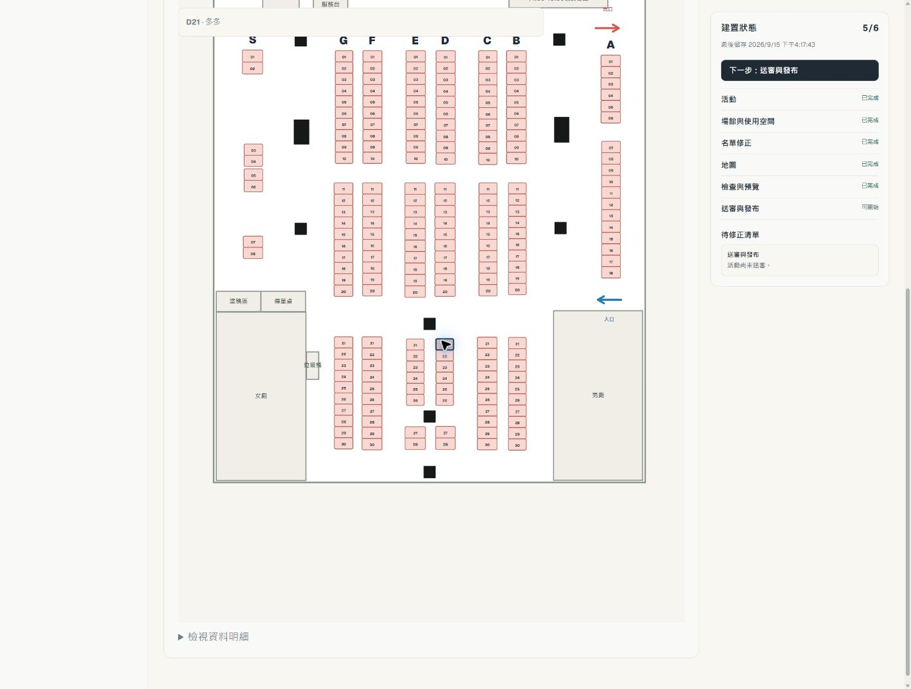
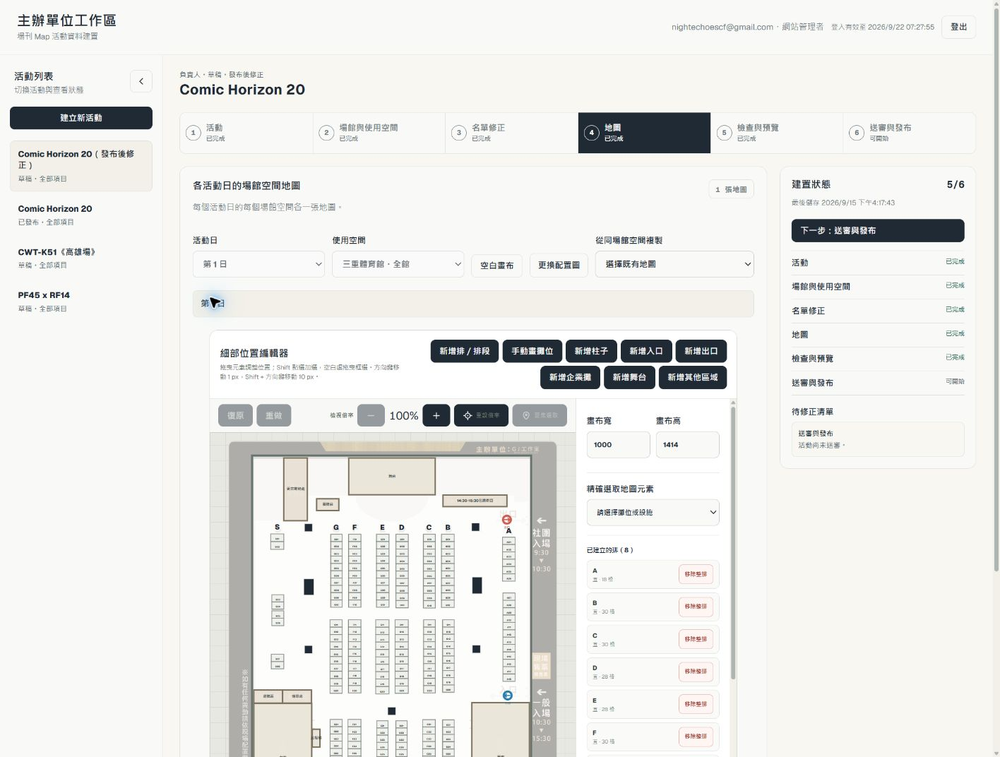
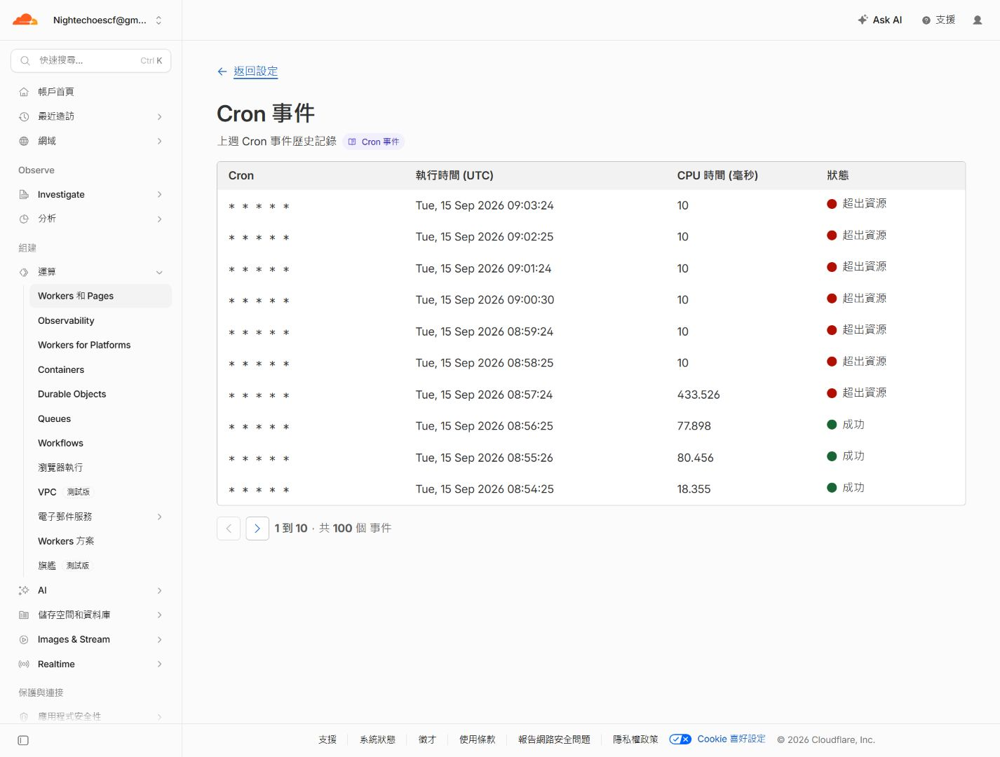
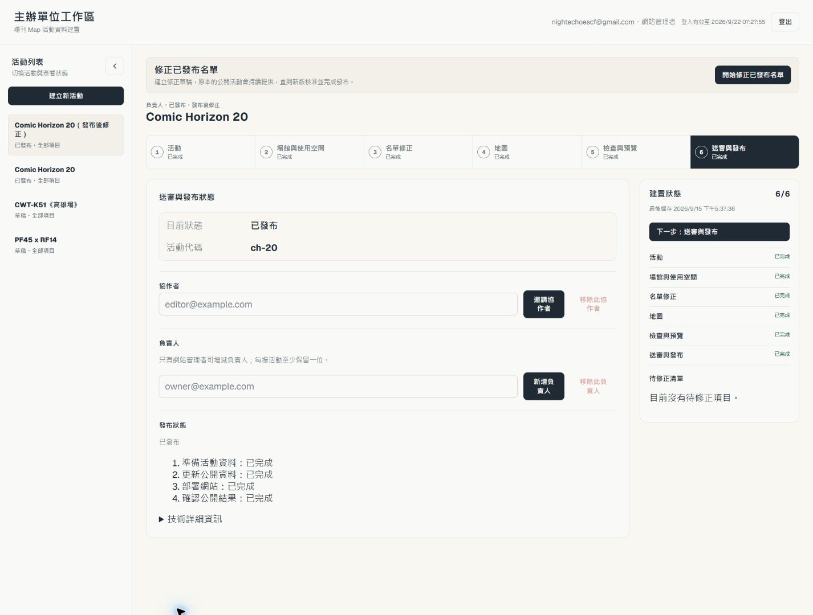
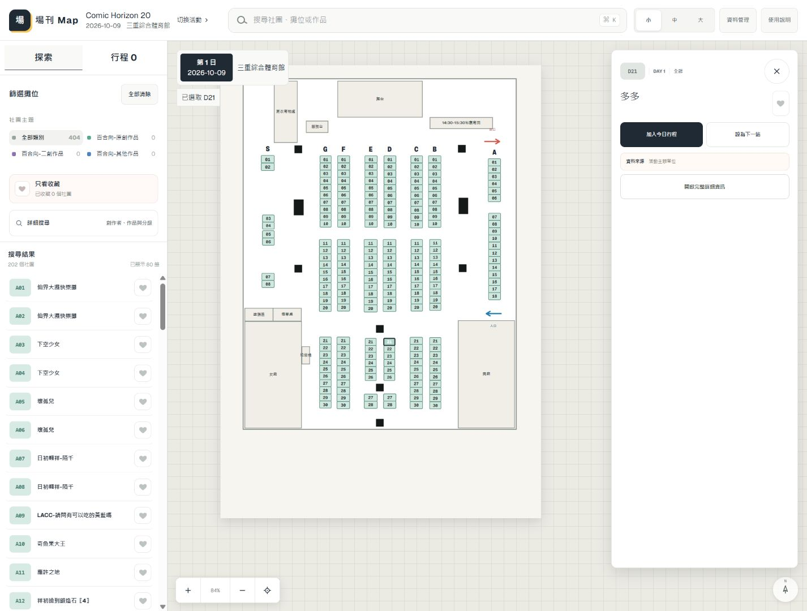

# CH20 地圖更正發布與 Worker 耗時驗收

**CH20 第 2 版地圖於 2026-09-15T09:37:36.071Z 正式發布。** 主辦親自儲存版型，Organizer 經 UI 完成檢查、Reader 預覽、送審與核准；系統完成 data → main → deployment → origin 驗證。底圖繼承缺陷已修復，CPU 資源阻擋由使用者升級 Paid 解除，兩次 UI 重試沿同一工作恢復；本次旅程包含工程補救，不宣稱零技術介入。本文技術時間採 UTC；主辦儲存時間另標為臺北時間。

[正式 Reader](https://tw-catalog.pages.dev/?event=ch-20) 顯示 Comic Horizon 20、2026-10-09、三重綜合體育館；202 格位置與標籤全量比對核准內容通過，D21「多多」可選取。170 個社團的 ID／名稱及 202 個 placement 保留，FF47 四份公開檔案與 pin 逐位元組未變。

## 已完成內容與證據

| 項目 | 結果 |
| --- | --- |
| 來源活動 | CH20 published candidate `1da921dd-9e1e-4ca3-b117-a31b526f1556` v15 |
| 更正候選 | `8b33a05b-aea7-4c96-9129-55de6824a228` v2 |
| 地圖 | `28a6ff34-ee39-49c3-b7b3-19f5d5be5af1` revision2，主辦臺北時間16:17:43儲存 |
| 真實變更 | D21–D28、E21–E28幾何配置，以及floor／pillars／landmarks；202碼保留 |
| 名單 | 170個社團、202個攤位，宣告0筆；艾B15／B16只保留既有註記，不再主動查證 |
| 檢查／預覽 | UI 0 errors／0 warnings，202個地圖標籤；D21「多多」可選取 |
| 送審 | `2026-09-15T08:47:06.463Z`，snapshot `aaa46d7e-d0a5-4a2b-a407-08214bc2210f` |
| 核准 | `2026-09-15T08:48:06.617Z` audit selfApproval=true |
| 核准hash | `e353f375077c44f026a3e2b178aa62526285ec53af815f969b75a4280d49e345` |
| Job | `c37a0a2f-e1be-46ae-9ba7-3e68414cbd54`，保留同一job／snapshot |
| Data發布 | 系統建立／合併 [data PR3](https://github.com/dekkmarsvin/tw_doujin_event-data/pull/3)，merge `12d994d0f3a660c030159eb7ec4df1c7d37be0bd` |
| Main發布 | 系統合併 [PR278](https://github.com/dekkmarsvin/tw_doujin_event/pull/278)，head `4ebffdb873ba540b8253597fea56cdde6110da18`；merge `6a02e6169e1e9d6df76d7cf551cc29d514380dc0` |
| 正式部署 | [run 34952897004](https://github.com/dekkmarsvin/tw_doujin_event/actions/runs/34952897004) attempt 1 成功；Verify and deploy、Browser acceptance、custom domain advisory 皆成功 |
| Origin | `2026-09-15T09:38:05.666Z` 獨立驗證；manifest SHA-256 `58ba02ddc4696b6b182700e1c3b823f1b4173e326c8c49f8cf1505f9a1359a1c`，commit 與 job 相同，8 檔 hash 通過 |
| 耗時 | 核准到 published 49 分 29.947 秒（包含等待帳戶升級與恢復）；最後一次 UI retry 到 published 3 分 38.992 秒 |

[主辦保存內容的比對](assets/ch20-map-correction-2026-09-15/user-saved-map-proof.json)、[預覽202個標籤](assets/ch20-map-correction-2026-09-15/preview-labels.json)、[底圖回驗](assets/ch20-map-correction-2026-09-15/background-inherited-proof.json)。

## 底圖修復

[#277](https://github.com/dekkmarsvin/tw_doujin_event/pull/277) 已合併main `2d66fbe07317d04b8c034e6bcb2cdad87be719d9` 並部署。修正地圖沒有自己的配置圖時，沿固定baseline的同活動日／場館空間讀取已發布來源。GET不寫入、不增加版本，保留私人讀取／MIME／保存期限；自行替換只更新自己的底圖。

主要獨立review Done，handler36/36、實作者及reviewer各自真D1 UI6/6、CI809/809。正式main Browser第一次因測試用Wrangler中止失敗；保留紀錄，聚焦判斷後僅重跑Browser一次，同head3m48s通過，沒有改斷言或重部署。[完整處置及正式回驗](https://github.com/dekkmarsvin/tw_doujin_event/pull/277#issuecomment-5677371738)。正式UI顯示原PNG底圖、儲存鍵停用且無未儲存變更；v2／map revision2不變，未重傳底圖或補寫D1/R2。

## 真實失敗與原工作恢復

Cloudflare Cron 歷史顯示 08:57:24 CPU 433.526 ms「超出資源」，後续至 09:25 的執行多次在 10 ms 中止。當時方案為 Workers Free，每次 CPU 10 ms；使用者處理升級後，09:29 UI 確認 Paid 為目前方案。帳戶方案是一次性基礎設施決策，費用頁顯示 US$5／月加用量費，agent 沒有代為訂閱。Worker 始終為 `bb1ab0e0-2aa6-4d40-b269-866922bab78c`，未重新部署；每分鐘 cron／github mode／正式 D1 binding 保留。

1. 09:26:36 原 job 記錄 `github_app_request`，retryable=true。09:30:18.835 經 UI「重試發布」，沒有重新核准或建立新 job。
2. 09:30:45 系統已合併 #278，隨後 GitHub 請求失敗，job 仍停在 `merging_main / github_api_request`，main checkpoint 未寫入。Cron outcome=ok 僅表示 handler 正常返回；該次 `publication.tick.results` 明確是 failed，不能當成發布成功。現有安全錯誤訊息沒有底層 HTTP／網路細節，不能將這兩次 GitHub 失敗確診為 CPU 或 subrequest 限制。
3. 09:33:57.079 第二次 UI retry，09:34 Cron 辨認原 PR 已合併，將同一 merge SHA 記入原 job，進到 `waiting_deployment`；沒有重新建立／合併 data 或 main PR。
4. 系統核對原 main merge 對應 run／attempt，09:36 進到 `verifying_production`，09:37:36.071 完成；原 candidate v2、snapshot／approval hash 和 data checkpoint 全部保留，該 candidate 只有一筆 publication job。

原 CPU finding 分類為 **MUST FIX NOW，阻擋正式發布／#190 里程碑**，Paid 後實際恢復與 published 證據已解除；#277 的程式 review 維持 Done。失敗至恢復期間沒有修改 production D1／公開 JSON、手動 merge publication PR、手動部署、停用防護或放寬 required checks。合併 data 後的 08:51 origin 比對仍是完整舊版；完成後則是完整核准新版，沒有半套公開資料。

[原 job、兩次 retry audit 與時序](assets/ch20-map-correction-2026-09-15/publication-recovery.json)、[正式 origin 全量驗證](assets/ch20-map-correction-2026-09-15/origin-proof.json)、[實際 Worker tick](assets/ch20-map-correction-2026-09-15/paid-runtime.json)。Main PR 的 required CI 及 Full preview portal E2E 已通過；main push 的 Full preview portal E2E 依既有事件條件 skipped，沒有將其記為通過。

## Worker 耗時評估

[Cloudflare 官方 CPU 定義](https://developers.cloudflare.com/workers/platform/limits/#cpu-time) 不包含等待網路／D1 的時間；每分鐘 Cron 的 Paid CPU 額度為 30 秒。正式 tail 將總經過時間與 CPU 分開：

| 真實 invocation | CPU | 總經過時間 | 工作結果 |
| --- | ---: | ---: | --- |
| 09:30 main 合併及回讀 | 477 ms（Dashboard 477.756 ms） | 20.415 秒 | PR 已合併，後續 GitHub 請求失敗 |
| 09:31–09:33 無 due job | 15–16 ms | 8.071–8.152 秒 | results=[] |
| 09:34 原合併恢復 | 335 ms | 14.367 秒 | advanced |

使用相同核准 hash 的 CH20 snapshot，在 Node 24.20.0、預熱 Vite SSR import 後，以 process.cpuUsage 量測 20 次，再用 V8 inspector 對合併純計算採樣 40 次。沒有使用 production token 或遠端寫入。這是定位熱點的本機量測，**不能等同 Cloudflare production CPU 毫秒**。原始 cpuprofile 留在本機 `.tmp/190-merging-main-local.cpuprofile`，[摘要](assets/ch20-map-correction-2026-09-15/cpu-profile-summary.json) 保留方法與輸入 hash。

| 本機階段 | 平均 CPU |
| --- | ---: |
| 解析 snapshot（100 次） | 0.78 ms |
| 完整核准產檔 | 29.7 ms |
| 一次 amendment planner | 20.3 ms |
| 一次 main stage | 94.55 ms |
| merging_main 的三次產檔／兩次 main stage | 218 ms |

主要來源是反覆處理身分登錄：1510 筆全活動 registry 的名稱正規化佔本機 active samples 40.44%，structuredClone 佔 25.98%。合併路徑有 3 次完整產檔、9 次 amendment planner／18 次 registry planner；等待 checks 也會先完整產檔一次。整個 snapshot 646,662 bytes、baseline 497,124 bytes，地圖僅 28,254 bytes，沒有內嵌配置圖 PNG。

每次 Cron 新建 repository，使 ensureTables 重跑 schema／migration／seed；無工作時已有 15–16 ms 固定 CPU 與約 8 秒總經過時間。這能證明固定成本存在，尚不能把全部 CPU 或等待時間歸給初始化。主要 reviewer 的隔離 fixture（10 份 artifacts）計得未合併 merging_main 有 55 次 GitHub call，27 次為同 invocation 相同 repo/method/path；恢復已合併 PR 為 32 GET。這不是正式失敗 invocation 的請求 trace，也不包含 token mint／D1／分頁／401 重試。

**FOLLOW-UP，不阻擋本次完成，留在 #190 原 thread：** 等待 checks 時延後完整產檔、同次執行重用已驗證 artifacts、依固定 SHA 重用 immutable commit/tree/blob，以及降低每 tick 初始化成本。任何後續優化仍須保留 fresh PR/checks/current pin、核准 snapshot、完整 tree、身分歷史、lease／intent 與 merge bytes 驗證。本輪只評估，沒有自動展開優化 PR。**DECLINE：** 將未知 GitHub request failure 直接歸因於 CPU／舊 Free 50 subrequests，現有證據不足。

## 人工介入與範圍

- 內容建立、主辦地圖保存、檢查／預覽、送審／核准、兩次 retry 皆透過 UI；工程與驗收的唯讀 CLI 另計。主辦完成內容後不需要 Git／CLI／agent／手動部署；此次底圖 bug 的實際工程介入仍保留。
- #277 一張工程修補 PR（人工工程 merge 1 次、自動 Pages 部署 1 次）及 Browser 聚焦重跑 1 次；本次核准後人工 production 資料寫入、人工 publication PR merge、CLI 發布寫入、Worker／Pages 手動部署皆 0。Worker 沒有為本次恢復 redeploy；正常 publication deployment 由系統完成。
- 一次使用者帳戶方案升級與兩次 UI retry 明確記錄；核准與發布只有同一筆 snapshot／job，沒有額外人工 Publish。新活動 repository／PAT／secret 為 0。
- 四種名單宣告及 Circle ID／舊 URL 保留沿用 #270–#276 已合併的針對性測試與真 D1 UI 驗收；本次真實更正為地圖，沒有假造名單異動。[FF47 Reader 回歸](assets/ch20-map-correction-2026-09-15/ff47-reader.png)、[202 格 DOM 幾何／標籤](assets/ch20-map-correction-2026-09-15/reader-geometry.json) 與 origin 證據共同完成公開驗收。
- #190 本次發布後更正驗收完成；#246 已[完成並結案](https://github.com/dekkmarsvin/tw_doujin_event/issues/246#issuecomment-5675169368)。#104／#212 既有首次發布非零補救指標不改寫，也不因子里程碑完成而自動關閉。
- 效能 follow-up 留在既有 thread，完整 audit/version browser、rollback UI、跨活動自動 linkage 及其他 backlog 不在本輪展開。
