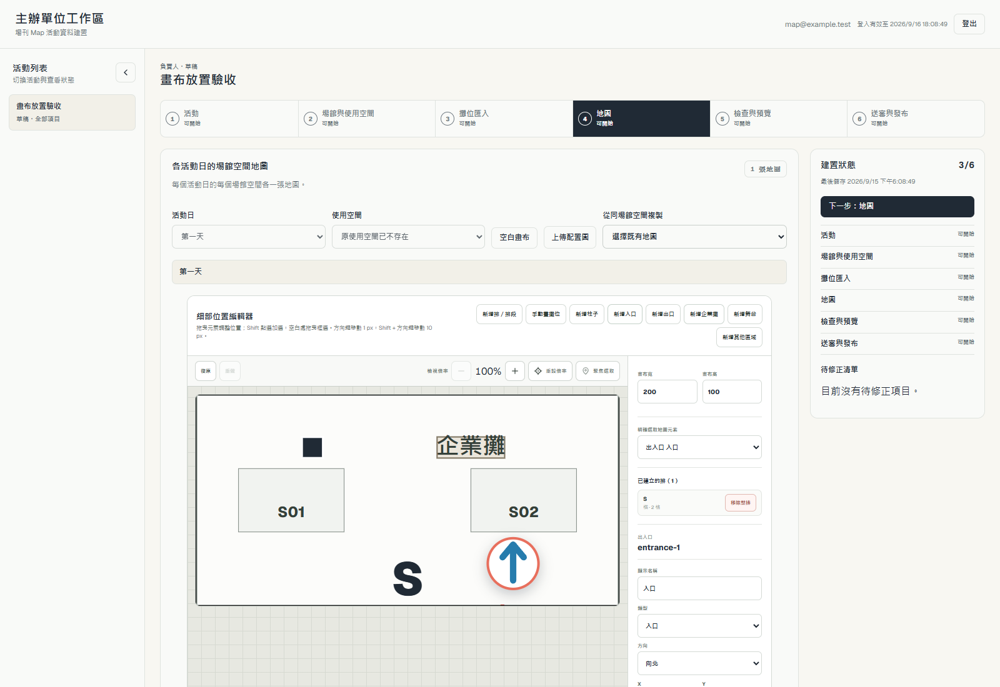
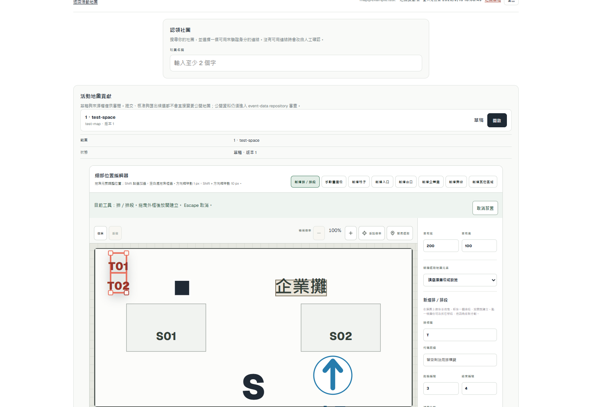
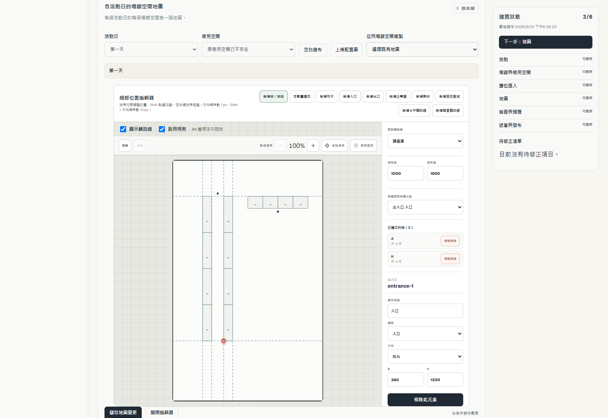
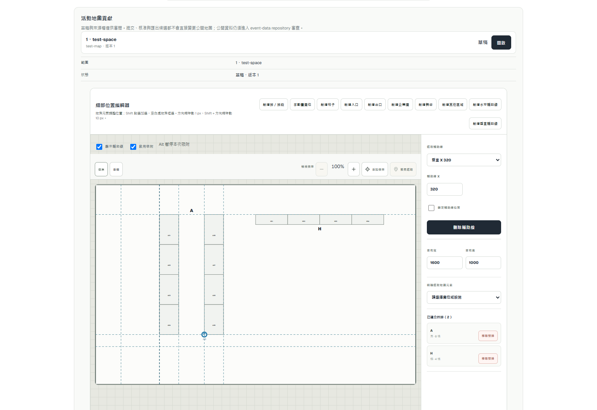

# 地圖精準描摹 #279 驗收

## 切片一：畫布放置

本機 Chrome 153、1600×1100，透過真正的 Organizer 與地圖貢獻介面操作；API 使用 sample 合成回應與記憶體保存，不代表正式環境驗收，不寫正式資料。

- 所有設施工具只進入放置模式；預覽不新增元素，Escape、切換工具、pointercancel 均不留元素。
- 柱子拖曳外框、企業攤單擊置中、入口單擊座標在儲存 payload 逐項比對；原有全部攤位保持相同。
- 每次放置選取新元素、退出一次性工具；一次復原移除整個元素，重做可恢復。
- 切回排段拖出 T01–T02，下一段自動從 3 開始；一次復原移除整段。手動畫攤位的 Escape 不建立元素。舞台、其他區域、出口單擊與復原均通過。
- 15 項相關模組測試、局部 ESLint、TypeScript 通過。required CI 與正式部署結果記於對應 PR。

可重跑 journey：`tests/browser/map-authoring-placement.mjs`，由 `npm run test:browser` 自動發現。[機器報告](assets/map-authoring-279/placement-report.json)。

輔助線／吸附及底圖／精度仍由 #279 下一切片承接；本切片不代表 #279 全部完成。

切片一正式部署：#281 合併為 `811c7e2edc70e2ef65cefd5f101c78b443211aaf`，production run `34957123251`。main Browser 的 references journey 首次在登入真人驗證前置回 403；地圖 journey 已通過。僅重跑失敗 Browser job 一次，attempt 2 全數成功，未更改檢查。2026-09-15T10:31:55.190Z [origin 核對](assets/map-authoring-279/placement-origin.json)：manifest commit 正確，8 份活動 bytes 及 pins 完全未變，Reader 200／匿名 session 401，manifest 穩定。

## 切片二：私人輔助線與吸附

本機合成 API 瀏覽器驗收使用 1000×1600 直幅（Organizer）及 1600×1000 橫幅（地圖貢獻）：六條共同外緣輔助線、同排 A01–A08 兩列反向編號，以及水平 H 排。保存 payload 驗證幾何、無縫分割、入場點交會吸附；重新載入仍保留座標與鎖定。另實走手動拖動、刪除／復原、Alt、整組外框移動吸附、排段角縮放及畫布／輔助線共同縮放復原。

模組與 D1 共 52 項通過：舊稿相容、metadata 限制、同距離手動線優先、不同 zoom 的螢幕容差、公開 artifacts 不含 authoring、两入口保存及原權限／版本衝突。這是本機接線驗收；required CI、獨立 review 及部署結果由本切片 PR 承接。

[輔助線 browser 報告](assets/map-authoring-279/guides-report.json)。

