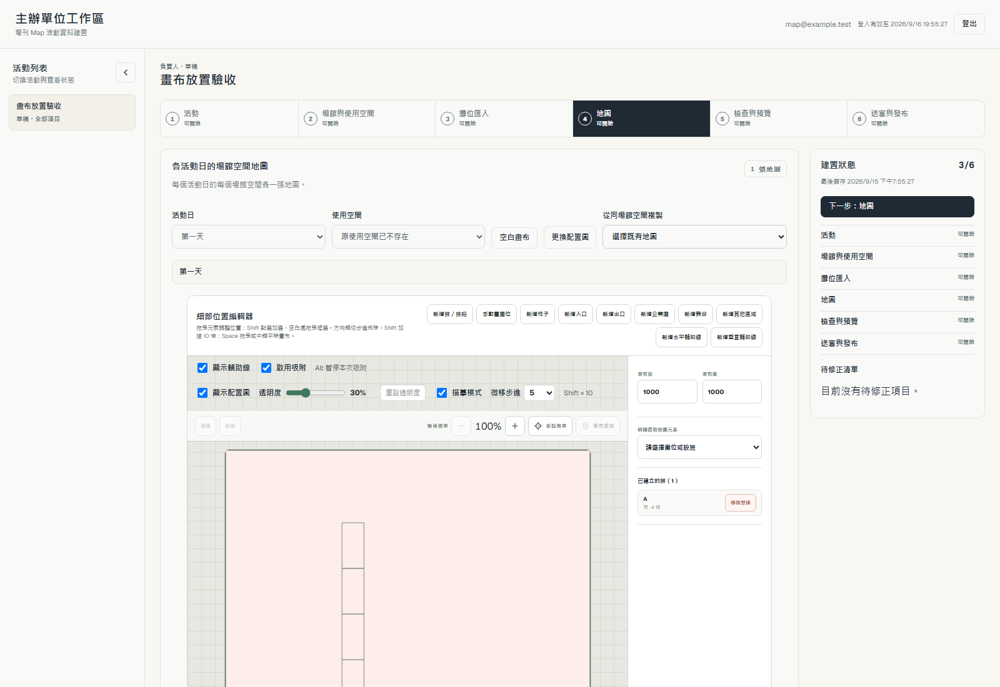
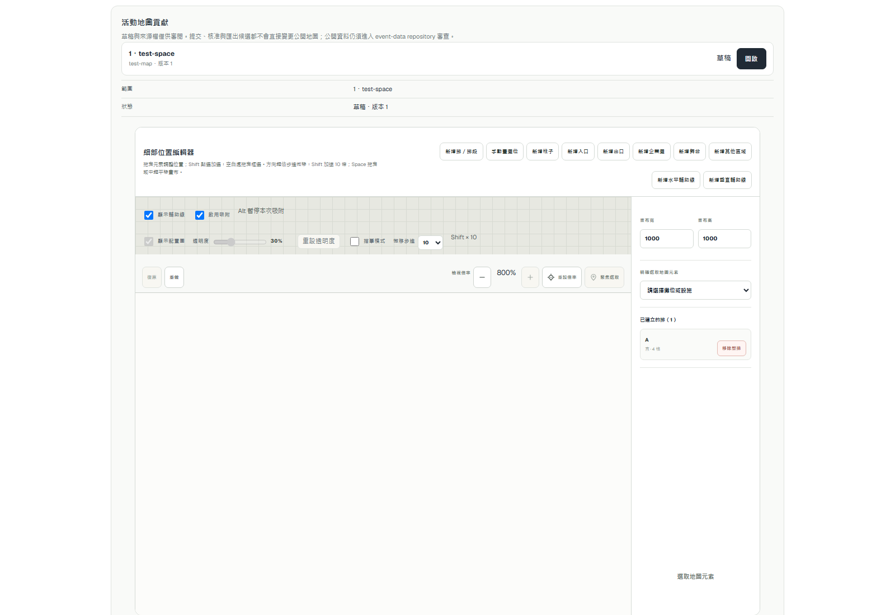

# 地圖精準描摹 #279 驗收

## 切片一：畫布放置

本機 Chrome 153、1600×1100，透過真正的 Organizer 與地圖貢獻介面操作；API 使用 sample 合成回應與記憶體保存，不代表正式環境驗收，不寫正式資料。

- 所有設施工具只進入放置模式；預覽不新增元素，Escape、切換工具、pointercancel 均不留元素。
- 柱子拖曳外框、企業攤單擊置中、入口單擊座標在儲存 payload 逐項比對；原有全部攤位保持相同。
- 每次放置選取新元素、退出一次性工具；一次復原移除整個元素，重做可恢復。
- 切回排段拖出 T01–T02，下一段自動從 3 開始；一次復原移除整段。手動畫攤位的 Escape 不建立元素。舞台、其他區域、出口單擊與復原均通過。
- 15 項相關模組測試、局部 ESLint、TypeScript 通過。required CI 與正式部署結果記於對應 PR。

可重跑 journey：`tests/browser/map-authoring-placement.mjs`，由 `npm run test:browser` 自動發現。[機器報告](assets/map-authoring-279/placement-report.json)。

輔助線／吸附及底圖／精度仍由 #279 下一切片承接；本切片不代表 #279 全部完成。

切片一正式部署：#281 合併為 `811c7e2edc70e2ef65cefd5f101c78b443211aaf`，production run `34957123251`。main Browser 的 references journey 首次在登入真人驗證前置回 403；地圖 journey 已通過。僅重跑失敗 Browser job 一次，attempt 2 全數成功，未更改檢查。2026-09-15T10:31:55.190Z [origin 核對](assets/map-authoring-279/placement-origin.json)：manifest commit 正確，8 份活動 bytes 及 pins 完全未變，Reader 200／匿名 session 401，manifest 穩定。

## 切片二：私人輔助線與吸附

本機合成 API 瀏覽器驗收使用 1000×1600 直幅（Organizer）及 1600×1000 橫幅（地圖貢獻）：六條共同外緣輔助線、同排 A01–A08 兩列反向編號，以及水平 H 排。保存 payload 驗證幾何、無縫分割、入場點交會吸附；重新載入仍保留座標與鎖定。另實走手動拖動、刪除／復原、Alt、整組外框移動吸附、排段角縮放及畫布／輔助線共同縮放復原。

模組與 D1 共 52 項通過：舊稿相容、metadata 限制、同距離手動線優先、不同 zoom 的螢幕容差、公開 artifacts 不含 authoring、两入口保存及原權限／版本衝突。這是本機接線驗收；required CI、獨立 review 及部署結果由本切片 PR 承接。

[輔助線 browser 報告](assets/map-authoring-279/guides-report.json)。

初審發現只有輔助線的 Organizer 草稿按「空白畫布」會略過清空確認。已將 guides 納入既有內容判斷；journey 核對確認出現、取消保留座標與 undo／redo 歷史。此為本 PR 的 MUST FIX NOW，修正後交同一 reviewer 聚焦確認。

正式啟用 gate：新版私人 snapshot 可含 authoring，舊 production Worker 的 strict parser 會拒絕。需先將通過 review 與 CI 的同 head 部署 publication Worker，確認成功後才合併啟用 Pages。這是一次工程部署順序，不是日常活動發布的人工步驟。

## 切片三：描摹顯示與精準操作

本機合成 API 瀏覽器驗收，Chrome 153、1600×1100，Organizer 與地圖貢獻控制面各走一遍同一個 `MapLayoutEditor`，1000×1000 畫布上一段四格直排。API 為記憶體合成回應，不寫正式資料。

- **底圖**：沒有配置圖時顯示／透明度／重設三個控制項為 disabled。上傳後逐值比對 `opacity` 於 0%、100%、64% 與重設回 30%；隱藏走 `visibility: hidden`（元素仍在，座標不動），配置圖的 `pointer-events` 維持 `none`。整段過程 `saves` 為 0。
- **描摹模式**：攤位 `fill` 由填色變為 `none`、格內代碼不可見，關閉後兩者都還原。
- **選取**：選取前後攤位的 `stroke-width` 相同且 ≤ 1.5px，不再改成 4px；另有一個獨立 selection overlay 矩形，線寬 ≤ 1.5px。resize 把手的可見方塊寬度小於其命中半徑。
- **微移**：步進選單為 0.1／0.5／1／5／10；實測 0.1、0.1+Shift（1）、5、10+Shift（100）四種位移，四次復原完全回到原位。
- **倍率與平移**：100% 時縮小為 disabled，連按放大到 800% 後放大鍵 disabled。Space + 拖曳與滑鼠中鍵拖曳各驗一次：`scrollLeft`／`scrollTop` 增加，且同一格攤位的四個屬性完全未變。
- **排段整體調整**：四個外框欄位讀回原座標；改 X 與高後四格同步移動、等高 125 且首尾貼齊外框、相鄰無縫。再按第二步改結束編號為 5、編號起點改由下往上，同一外框重切為五格等高 100，A01 落在最下方；一次復原回到四格。
- **偏好不進草稿**：開描摹、改步進後 `saves` 仍為 0；儲存後 payload 不含偏好欄位，重新載入頁面兩項偏好仍在。

模組測試新增 `map-editor-preferences`（5 項）與 `map-segment-edit`（7 項），涵蓋偏好逐欄退回、步進白名單、透明度夾限、外框 clamp、無縫等分、跨排段代碼衝突與無效選取。module tier 共 60 檔通過；`npx tsc --noEmit` 與本次改動檔案的 ESLint 通過。三條地圖 journey（placement／guides／trace）同一份伺服器連續執行皆通過，確認前兩切片未被破壞。required CI、獨立 review 與部署結果由本切片 PR 承接。

可重跑 journey：`tests/browser/map-authoring-trace.mjs`，由 `npm run test:browser` 自動發現。[機器報告](assets/map-authoring-279/trace-report.json)。

至此 #279 三個切片的驗收條件皆有對應實作與可重跑證據。
