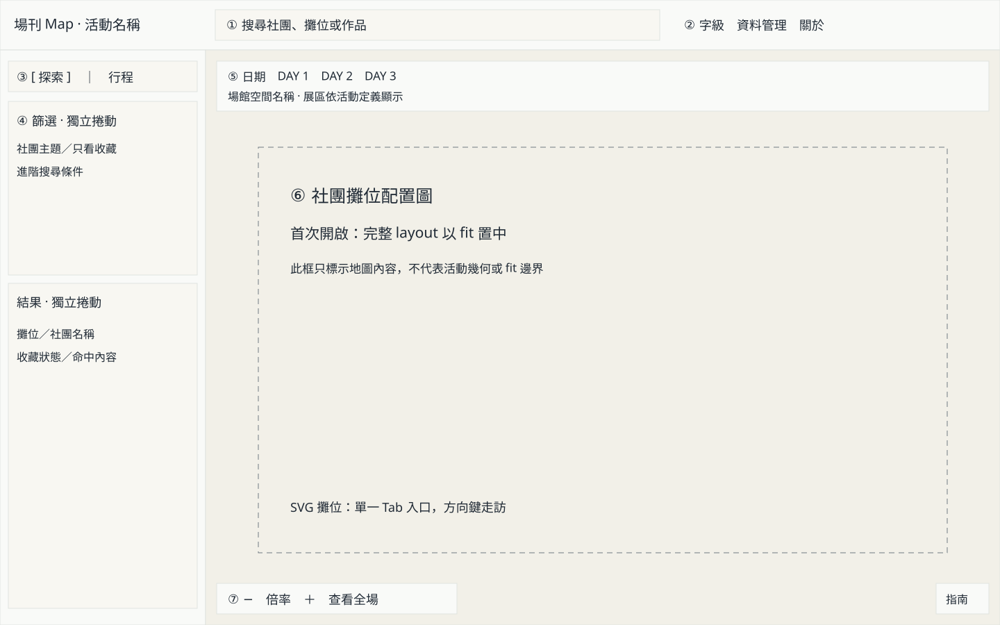
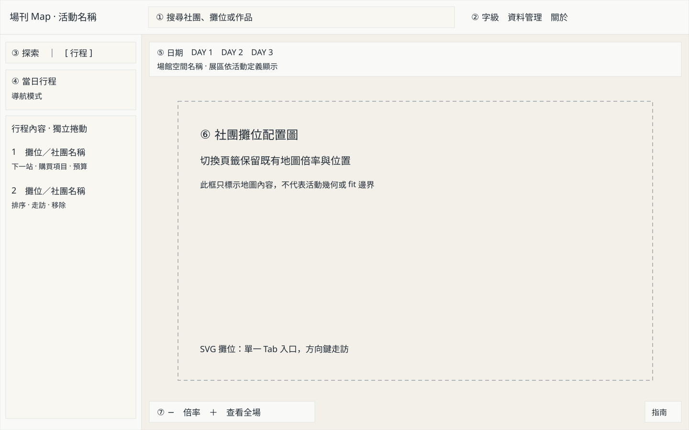
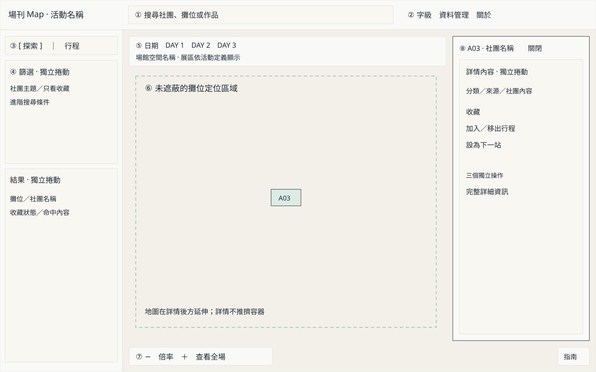

# 地圖新介面技術落地規格

- 狀態：**已實作並完成本機驗收**；2026-09-09。證據見第 10 節；尚未部署。
- 範圍：公開閱讀端桌機介面、視域與攤位文字；不修改資料模型、後端或部署流程。
- 依據：[原方向提案](./map-viewport-direction.md)、[驗證紀錄](./map-viewport-validation.md)，以及使用者後續確認的版面與初始化取捨。
- 決策優先序：本文件的目標行為 > 驗證文件中的候選方案 > 原提案與生成概念圖。現況仍以程式、[地圖契約](../contracts/event-map.md)、[URL 契約](../contracts/url-state.md)與 [DESIGN.md](../../DESIGN.md)為準。

## 1. 已確認的方向

桌機由常駐三欄改為「可切換的左欄＋地圖＋條件式詳情覆蓋」。保留既有暖紙色、深墨文字、分類色、細邊線與工具型介面，不採用概念板外圍標語、手寫字、假資料或第二個搜尋框。

**首次開啟維持完整場館 fit。** 取消原提案軸線 A 的固定可讀初始倍率；125% 僅是舊概念圖數字，不是常數或驗收值。不自動定位收藏、下一站或行程第一站。有效 URL 選取仍恢復並定位。

第一期包含文字可讀性：概觀的格內數字會隨格子縮小但不省略，放大後顯示清楚的代碼；不承諾 fit 下所有攤位都可讀。不加入 minimap、圖磚、路徑演算法或新的篩選／排序能力。

## 2. 純介面結構圖

以下三張 SVG 是**同一頁的不同狀態**，每張外框都是完整的 1440 × 900 CSS px 頁面，不存在圖外裝飾區。數字是文件焦點群組註記，不出現在正式產品。虛線是工程區域標記，不是實際配置圖或地圖上的 UI。

### 2.1 探索



頂部 72px、左欄 296px、地圖容器 1144 × 828px。篩選與結果各自捲動；地圖由平移／縮放操作，頁面本身不產生桌機縱向捲軸。地圖內容框只是示意，實際 fit 按完整 layout 計算。

### 2.2 行程



左欄寬度維持 296px，切換時不 resize 地圖。行程標頭與導航入口固定，列表獨立捲動，包含排序、走訪、購買項目、預算與移除。切到行程不等同啟用導航模式。

### 2.3 選取與詳情



詳情右側留 16px，寬 330px；地圖仍為 1144 × 828px，從其座標系計算未遮蔽區域。圖中的虛線與 A03 僅說明定位關係，不代表 FF47 真實攤位位置。詳情有自己的捲動區，不形成第四個頁面欄位。

三圖共同焦點群組順序：①搜尋 → ②字級／資料管理／關於 → ③左欄頁籤 → ④目前左欄內容 → ⑤日期／場館空間與適用的展區 → ⑥SVG 單一入口 → ⑦縮放控制 → ⑧已開啟的詳情。品牌純文字不佔 Tab；日期及工作頁籤使用方向鍵切換、單一 Tab 入口。指南針若僅指示方向，不可偽裝成按鈕。

## 3. 版面、尺寸與元件責任

### 3.1 工作區

| 範圍 | 目標 |
|---|---|
| >1050px | 左欄 296px，地圖 `minmax(0, 1fr)`；探索、行程與導航使用相同欄寬 |
| 761–1050px | 左欄 248px；地圖容許縮至剩餘寬度，不沿用 400／430px 的桌機最小寬度 |
| ≤760px | 保留現有手機 header、四頁籤底部工作面板、三段高度與手勢；本次桌機頁籤、浮層與標籤策略不套用到手機 |
| 頂部 | 基準 `min-height:72px`；搜尋彈性伸展且 `min-width:0`，長活動名截斷並保留可存取全名 |
| 文字放大／窄桌機 | 頂部容許換行、搜尋成為下一列；DOM 焦點順序不變，禁止硬壓文字或藏掉關鍵操作 |
| 工作區高度 | shell 使用 `100dvh`（`100vh` fallback）、列高 `auto minmax(0,1fr)`；由實際 header 高度取得剩餘空間 |
| 地圖 | 移除外側內距、容器圓角與邊框，保留暖色地圖背景及 layout 本身的場館紙張，不移除 floor 幾何 |
| 詳情 | `width:min(330px, calc(100% - 32px))`，相對地圖定位，左右最少 16px；頂 16px、底 76px，內容獨立捲動 |

桌機樣式集中在頁面 CSS Module；全域 CSS 的同名舊規則須在正式實作時刪除或限定手機範圍，不再維護兩份競爭的 grid 欄寬。所有可捲動 flex/grid 子節點都設 `min-height:0`；不以 body overflow 掩蓋尺寸錯誤。

### 3.2 左欄、搜尋與導航

- `explore` 與 `plan` 面板維持掛載，非作用中面板使用 `hidden`，不可留下可聚焦子元素；各自記錄 scrollTop，切回時恢復。活動切換重置；同活動日期切換保留頁籤，但行程捲到頂。
- 探索由篩選區、結果區組成；篩選至多佔可用內容高度的 45%，區內捲動，結果佔剩餘空間。只有頂部一個搜尋輸入，搜尋變更切到探索並讓結果捲到頂，不清除已選社團。
- 啟用導航會切到行程；僅切頁籤不改導航。導航中切回探索時仍維持導航投影，地圖持續顯示「導航模式」及退出入口。開始搜尋先退出導航以呈現探索結果，保留全部搜尋／篩選條件。
- 導航不隱性改寫原本日期、展區或規劃條件；需要全區投影時只作用在衍生資料。退出恢復原探索投影。這包含修正現有 `toggleNavigationMode` 改寫展區的行為，遵守領域詞彙的導航定義。
- 日期改變清除不再適用的選取與詳情，保留收藏及各日行程。收藏、行程、下一站的操作仍委派既有規劃函式。

### 3.3 浮動工具與層級

工具相對 map 容器定位，與 SVG 縮放分離：左上位置列（日期、場館空間、適用展區）、其下的導航／下一站提示、左下縮放及查看全場、右下指南針。

- 場館空間／展區選項來自 event definition；沒有多個有效選項時顯示名稱，不畫無作用的下拉箭頭。FF47 不顯示 A–K／L–W 切換。
- 詳情開啟時，左上工具群最大寬度扣除詳情寬度與兩側間距；不足時改為直排標籤＋選單。工具群過高時在地圖高度 30% 內捲動，保留地圖可操作區。
- 下一站提示和導航提示放在同一工具群的互斥區域，不再個別 absolute 到相同 top。下一站移除操作須明確標成「從行程移除」，不可用看似只關閉提示的無標籤叉號。
- 層級由低到高：SVG 0、定位提示 1、地圖工具 2、詳情 3。資料管理與完整詳細資訊仍 portal 到文件根層，沿用既有 dialog 層級；不把對話框放進 map stacking context。
- 正常的「資料僅儲存於瀏覽器」放在資料管理；初始化讀取在同入口呈現，儲存錯誤則在入口旁以可見文字與 `role=status` 持續提示。

## 4. 視域與事件狀態

### 4.1 狀態所有權

| 狀態 | 所有者／生命週期 |
|---|---|
| 日期、展區、搜尋、選取 | 既有 controller／URL codec，不新增參數 |
| `desktopPanel: explore \| plan` | controller 記憶體，預設 explore，不持久化 |
| `desktopDetailsOpen: boolean` | controller 記憶體，必須有有效選取才能為 true |
| 倍率、offset、fit 下限 | 視域 controller；手動平移／縮放不寫 URL |
| scope 初始化與待恢復選取 | 依活動、實際 map artifact scope、revision 分域；過期非同步回應不得套到新 scope |
| 規劃／導航投影 | 既有 planning store 與 workspace projection；新頁籤不寫 store |

手機沿用原來選取和關閉語意；由桌機進手機時以現有選取投影詳細資訊，無選取則依桌機頁籤投影結果／行程。回桌機保留最後桌機頁籤，有有效選取時開啟詳情。斷點切換不是新的資料 scope，不重跑首次初始化。

### 4.2 可用矩形與置中

所有幾何值使用 **map 容器本地 CSS px**。DOM rect 先減去 map 左上座標，再交給純函式；floor inset 必須讀取實際值，不假設仍為 18px。

定位用矩形採確定的保守邊界：左右基準各 16px；詳情開啟時右邊界取「詳情左緣 − 16px」；上邊界取「頂部工具群／狀態群最下緣 + 16px」；下邊界取「底部控制最上緣 − 16px」。忽略未顯示的群組，所有值 clamp 在 map 內。圖 2.3 的虛線即為此矩形；不用不連續可見面積的重心。

位置 `(sx, sy)` 為 slot 中心的 layout 座標，`floorScale = floorHeight / layout.height`，`target` 為可用矩形中心：

```text
offset.x = target.x - floorInset.x - sx * floorScale * zoom
offset.y = target.y - floorInset.y - sy * floorScale * zoom
```

矩形寬或高非正值時不寫入 offset，也不產生 NaN；等 ResizeObserver 得到有效尺寸後處理最後一筆定位請求。選取與焦點提示同步顯示，避免等待過程無回饋。

**新桌機 fit 規則**：按扣除固定工具群後的矩形計算，矩形對 map 邊界與工具各留 16px，內部不再疊加 padding，詳情不算入 fit 邊界。計算 fit 矩形時使用「詳情收起時」的工具排版尺寸；詳情開啟造成工具換行不得改變 fit 下限。controller 以不參與焦點及可存取樹的同寬測量容器取得這組尺寸，renderer 不參與測量。初始化、最小倍率、查看全場及原本在 fit 時的 resize 共用此結果；查看全場先收起詳情。手機使用原規則。

這是對現有「完整 map 容器扣 padding」計算的桌機調整，必須同步縮放契約；原因是新浮動日期工具可能遮住 fit 後的場地。詳情實際開啟時的工具尺寸僅用於選取定位矩形，避免詳情開關引起倍率跳動。

### 4.3 狀態轉移表

| 事件 | 倍率／位置 | 選取、面板與副作用 |
|---|---|---|
| 首次 map 與非零 viewport 就緒 | 新桌機 fit 置中一次 | 預設探索；不等待收藏／行程載入才顯示地圖 |
| 初次有效 URL 選取稍後恢復 | 保留現有倍率，詳情測量後定位一次 | 恢復選取、開詳情；不產生第二次 fit |
| 無效 URL 選取 | 維持目前視域 | 沿用 codec 校正，無詳情 |
| 使用者在 URL 資料恢復前操作地圖 | 保留手動操作 | URL 可恢復選取，但取消過時的自動置中；仍顯示詳情，後續明確點選再定位 |
| 地圖／結果／行程選取 | 倍率不變，移到可用矩形中心 | 開詳情、沿用既有 URL history intent；同一選取再次點擊也開啟 |
| 詳情關閉或 Escape | 不移動、不縮放 | 只收起桌機詳情，保留選取與 URL；焦點還給觸發來源 |
| 查看全場 | 收起詳情後套用新桌機 fit | 保留選取、URL、收藏與行程；鍵盤焦點留在按鈕 |
| 同 scope 日期變更 | 保留視域 | 清除選取與詳情；使用新日期資料，不因共享 map 重設 |
| 活動或 map artifact scope／revision 變更 | 等新 map 就緒後 fit 一次 | 不顯示舊 map 假裝載入完成；只恢復新 scope 有效的選取 |
| resize，原本在 fit（差 <0.006） | 新 fit 重新置中 | 不建立 history |
| resize，手動視域 | 保留中心的 layout 座標；倍率低於新下限時只夾到下限 | 不因仍有 selected 就持續吸回攤位；詳情開關不屬於 map resize |
| map 載入失敗／重試 | 不對缺失幾何計算 fit | 顯示錯誤與重試；新 scope 成功後才初始化，不把舊 offset 套入 |
| 瀏覽器前進／後退 | scope 不變則保留倍率，定位恢復的有效選取 | 有效選取開詳情，無選取收起；history 恢復不再 push |

選取定位等 React commit、詳情及工具尺寸完成後以單次 rAF 套用；ResizeObserver 只更新幾何或執行尚未完成的定位，不能每次 render 都重新選取置中。使用者後續拖曳取消待執行的舊定位。

## 5. 攤位文字與 renderer interface

### 5.1 顯示策略

桌機新增可選 renderer 輸入 `labelPresentation: { screenScale: number; targetPx: number; paddingPx: number }`，預設不傳即沿用舊策略，手機不傳。`screenScale` 為「一個 layout 單位換成多少 CSS px」，即 floor 實際尺寸比例乘 zoom；標準值 target 12、padding 2。不是 devicePixelRatio，不以 125% 或 FF47 layout 尺寸寫死。

字級控制沿用全域 1／1.12／1.24 比例，target 分別 12／13.44／14.88 CSS px；padding 固定，仍優先避免溢出。格子仍不足時靠完整代碼提示補充，不硬塞放大文字。

一般格文字仍是現有數字部分，排字母由排標提供。媒體門檻維持 145%，有縮圖時底部 38% 格高作標籤帶（與遮罩 rect 共用 `MAP_MEDIA_LABEL_BAND`），無圖時使用完整格高；圖片及文字皆限制在該 slot。

```text
S = screenScale（必須有限且 > 0）
W = max(slot.width * S - 2 * paddingPx, slot.width * S / 2)
H = max(labelBandHeight * S - 2 * paddingPx, labelBandHeight * S / 2)
N = 字元數（一般格使用既有數字字串）
fontPx = min(targetPx, W / max(1, N), H / 1.2)
fontInLayoutUnits = fontPx / S
```

每字以一個 em 估算，刻意比等寬數字實際字寬保守，避免 renderer 讀 DOM 或量測字型。**沒有下限門檻，代碼一律 render**，格子太小只是字跟著變小；標籤帶不足以同時容納 2px 內距時，內距最多讓出一半而不是把字消掉。字行盒置中於可用標籤帶，透過每 slot 的 clipPath 作最終防線。高亮、收藏、下一站標記仍可見，aria-label 不受字級影響。

### 5.2 完整代碼提示

selected 或 roving keyboard focus 具有完整代碼提示；鍵盤焦點存在時優先顯示焦點攤位，否則顯示 selected。提示放在固定工具群中，以正常介面字級呈現，不放大格內文字或壓住相鄰格。selected 在全場概觀中保留標記，不等於詳情必須展開。

renderer 新增可選 `onFocusCode?: (code: string | null) => void` 回報方向鍵／focus 的攤位與離開 SVG，controller 使用 layout 資料投影提示。此事件不寫 URL、不變更選取、不自行讀規劃 store。SVG aria-label 繼續包含社團與所有規劃狀態。

### 5.3 模組責任

| 模組 | 新責任／不變界線 |
|---|---|
| `app/event-map-app.tsx` 與 CSS Module | 頁籤、詳情展開、DOM 尺寸、初始化協調、固定提示與 focus 還原；沿用選取解析和規劃動作 |
| `app/map-viewport.ts` | 純計算可用矩形、基於矩形的 fit／center offset、resize 保留中心；保留原函式的手機與其他呼叫端相容性 |
| `AccessibleEventMapRenderer` | 依明確比例投影文字、clip、focus 通知；不增加 DOM 測量、URL 或儲存存取 |

不新增公開 HTTP API，不改 event-map、catalog、planning schema；頁籤及詳情展開不寫 localStorage。建議純函式輸入只含 viewport、工具 bounds、detail bounds、floor 尺寸與 slot point，輸出矩形／MapView，不傳 React ref。

## 6. 可存取性與互動細節

- 活動名稱成為唯一 h1；「社團攤位配置圖」保留為地圖可存取名稱，不新增第二個 h1。
- 左欄 tablist 使用標準 roving Tab：左右鍵及 Home／End 換頁，tab 與 tabpanel 以 id 關聯；切頁焦點留在 tab。
- 詳情是非 modal region；開啟後焦點留在結果／SVG／行程來源，以禮貌狀態訊息告知詳情已更新，不搶走方向鍵走訪。Tab 可進詳情；無 focus trap。
- Escape 只在詳情及其子內容內收起詳情；若有更上層對話框，先由該對話框處理。關閉按鈕與 Escape 都還原觸發元素；元素已不存在時依序退回 SVG 入口、作用中左欄頁籤。
- 隱藏面板不在 tab order；關閉詳情後不可有焦點落在 hidden 內容。載入完成、fit 或平移不反覆公告倍率。
- 狀態保留文字／圖形，不僅用色彩；控制器 hit area 至少 44px。reduced-motion 停用轉場，地圖拖曳縮放維持直接跟手。

## 7. ADR 與現況文件同步清單

正式實作前提出新的 ADR（依屆時 INDEX 分配編號，不預占）：**桌機地圖採雙區工作區與條件式詳情覆蓋**。

決策內容：桌機探索／行程入口共用左欄、詳情不占 grid 欄位；首次維持 fit；固定工具造成的遮蔽納入 fit，詳情遮蔽只納入選取定位；按格子空間投影代碼；本機面板狀態不進分享 URL；minimap 仍不做。

明說與既有 `DESIGN.md` 的 Three-Zone Rule 衝突，並擴充 [ADR-0001](../adr/0001-adopt-webcatalog-patterns-selectively.md) 的版面參考範圍。保留 SVG、靜態閱讀與本機規劃資料等限制，不重寫舊 ADR 內文。

| 實作合併時同步 | 要更新的現況 |
|---|---|
| DESIGN.md／元件規格 | 欄寬、header 自適應、詳情覆蓋、手機邊界、工具層級與字級 |
| 活動地圖契約 | 新桌機 fit 矩形、初始化、完整代碼提示、文字省略與詳情定位 |
| URL 契約 | 選取保留但詳情可收起；重新載入有效選取連結會開詳情；無新增參數 |
| 搜尋／規劃契約 | 桌機入口移動、導航與探索狀態獨立；沒有資料 schema 變更 |
| 本規格與原提案 | 記錄已實作部分及驗收證據，移除已過期的「待實作」描述；保留原估算為歷史 |

實作已同步上述現況契約與 ADR-0055；本次未建立 GitHub issue／PR 或部署。

## 8. 驗收矩陣

| ID | 場景／輸入 | 預期結果與證據 |
|---|---|---|
| G1 | 新 viewport、floor、工具 bounds，詳情關閉 | 新桌機 fit 讓完整 layout 貼齊排除固定工具的矩形，受限軸完全用滿；縮小下限與重設一致 |
| G2 | 同一 viewport 開／關詳情 | fit 下限不變；點選攤位後中心位於未遮蔽矩形內、倍率完全相同 |
| G3 | 零尺寸、工具換行、scope 快速切換 | 無 NaN；只處理目前 scope 及最後有效定位，舊回應不覆蓋 |
| G4 | fit resize／手動視域 resize | 前者重新 fit，後者保留中心；僅低於新下限才夾值，不回到 selected |
| T1 | 字級計算結果 7.99／8／12px 與極小標籤帶 | 一律顯示、只有字級不同；標籤帶容得下時都在 2px inset 及 clip 內 |
| T2 | 144.9%／145%、有圖／無圖、長代碼、三種字級 | 媒體門檻不變；標籤帶不溢出；缺圖使用完整格，aria-label 始終完整 |
| T3 | fit 中格內數字過小難以辨識，選取／方向鍵走訪 | 固定完整代碼提示可讀，狀態標記可辨識，不要求打開詳情才知道代碼 |
| S1 | URL 選取比 map 晚到；中途有／無手動操作 | 倍率不回彈；無手動操作定位一次，有手動操作不搶走視野 |
| S2 | 詳情 → 查看全場 → 同攤位點選 | 收起並 fit、選取與 URL 保留、再次點選重開；planning 完全不變 |
| S3 | 探索／行程切換，長列表 | 各自內容與捲動恢復、地圖不跳動、不自動啟用導航 |
| S4 | 導航中切探索、輸入搜尋、退出 | 投影與條件依 3.2 規則一致，原篩選不被清空或改成全區 |
| S5 | 同 scope 日期切換／新 scope／前進後退 | 依轉移表，無重複 history；不同日不殘留錯誤選取 |
| V1 | 1440×900、1920×1080、1024×768 | 三狀態各截圖；map rect、header 高度、工具 rect、fit 與字級記錄；無 body 水平溢出 |
| V2 | 760／761、1050／1051px，字級標準／較大／最大 | 正確布局切換，工具不相互遮擋；手機保留四頁籤與三段高度 |
| V3 | 無選取、空行程、長行程、長社團名、讀取及儲存錯誤 | 無空白右欄；資訊可捲動；錯誤與恢復入口持續可見 |
| A1 | 純鍵盤完整流程、trigger 被篩掉、上層 dialog | 唯一 h1、單一 SVG Tab 入口、正確焦點還原；Escape 不穿透 dialog |
| A2 | reduced-motion、灰階／狀態文字 | 無非必要轉場；收藏、下一站、選取不只靠顏色區分 |

純計算擴充現有 `tests/map-viewport.test.mjs`；controller／renderer 行為加入相應模組測試，不以掃 CSS 字串代替行為測試。瀏覽器情境依專案既有工具記錄；後續正式程式交付執行[本機驗證](../runbooks/local-development.md)規定的 gate。

**資料證據**：本機 `.event-data/ff47/map.json` 為 revision 3、2400 × 1696；public staging 曾為 sample fixture。正式驗收須記錄資料來源、pin commit／hash、revision、瀏覽器、viewport、字級與截圖。fixture 結果不能標成正式 FF47；數學試算不能標成 DOM 實測。本次實作的行為測試與瀏覽器證據見第 10 節。

## 9. 可交接工作單元

| 工作單元 | 輸入 | 產出／驗收 | 相容邊界 |
|---|---|---|---|
| 1. 版面與面板狀態 | 本規格 2–4、6 節；既有結果／詳情／行程元件 | 新桌機布局、頁籤及展開狀態、工具位置；S2–S4、V1–V3、A1 | 不改 schema／URL 參數，手機行為維持；不宣稱可讀性已完成 |
| 2. 視域與字級 | 單元 1 提供 bounds；4–5 節的純計算規則 | fit／定位／resize、labelPresentation、focus 提示；G1–G4、T1–T3、S1、S5 | 可選輸入保留舊 renderer 呼叫端；保留媒體門檻及縮放上限 |
| 3. 整合驗收與契約同步 | 前兩單元、正式 pinned 資料、新 ADR | 完整矩陣與手機回歸證據；第 7 節文件同步 | 測試通過後才描述為現況；部署／發布另依既有流程 |

三單元可分別審查，但未完成單元 2–3 前不把部分改版當成已完成的新介面。文件驗收：三張圖均可讀、相對連結有效、狀態與尺寸無互相矛盾、每個單元有可測輸入／結果，且原提案明確指向新規格。

## 10. 2026-09-09 實作驗收紀錄

三個工作單元均已落地：桌機探索／行程左欄、條件式詳情、獨立捲動、浮動工具、視域 controller、格內標籤與完整代碼提示；手機保留四頁籤。ADR-0055、DESIGN.md、元件與四份行為契約已同步。桌機導航退出入口固定在底部控制列，避免上方工具捲動藏住操作。

### 資料與環境

- 本機 pinned FF47：repository dekkmarsvin/tw_doujin_event-data，commit `8c645303fa6838383549fbe8433ece081c514e1e`。
- map.json SHA-256：`d5f047a673baf166aba8e78794391523d305f340991eb608f74bc37de53f2a96`；revision 3，2400 × 1696，988 slots。
- Chrome 152.0.7977.83，localhost Vite；不是正式站驗證。錯誤、長內容與 scope 切換使用明確標記的合成情境。
- 本機 `outputs/map-viewport/browser-report.json` 保存 DOM rect、倍率、header／工具尺寸及標籤數量，同目錄保存 PNG；狀態補測為 `browser-state-report.json`。outputs 不納入 Git。

### 要求與證據

| 要求 | 完成證據 |
|---|---|
| G1–G4 | map-desktop-geometry／map-viewport 純計算測試；browser state-and-resize、zero-geometry-last-selection、synthetic-scoped-map-and-stale-response：fit、詳情不改倍率、手動 resize、零尺寸及過期回應 |
| T1–T3 | map-label-renderer／geometry 測試：字級邊界、clip、媒體標籤帶與 focus；最大字級放大 DOM 實測 988 個標籤均在 slot inset 內；固定完整代碼由瀏覽器驗證 |
| S1–S2 | late-url-manual-false／true、selection-before-map、state-and-resize：延後恢復不搶走手動視域，查看全場保留選取及規劃，重新點選開啟詳情 |
| S3–S4 | state-and-resize、synthetic-long-plan-scroll，加 workspace-projection 測試：捲動恢復、導航／搜尋及保留條件 |
| S5 | shared-day-and-history、synthetic-scoped-map-and-stale-response、map-error-and-retry：共享日期、history、分域載入及錯誤重試 |
| V1–V2 | 六種桌機尺寸 × 三字級 × 探索／行程／詳情，共 54 張；760px 三字級 3 張，四頁籤及面板高度斷言；無 body 水平溢出 |
| V3 | 空行程包含在矩陣；長行程／長名稱、儲存異常及 map 重試共 3 張合成截圖與行為斷言 |
| A1 | keyboard-focus-and-dialog：唯一 h1、頁籤與 SVG roving focus、詳情焦點還原、上層 dialog Escape |
| A2 | 瀏覽器採 reduced-motion；CSS 停用非必要轉場，SVG 保留選取描邊、收藏圓點、下一站箭頭與文字，不僅依賴顏色 |

獨立視覺 reviewer 看過全部 60 張必要截圖，未發現影響使用的版面偏差；要求修正的舊三欄文件已同步。文件子代理因用量限制停止，文件收尾由主代理完成。設計 detector 的既有色彩 advisory 未導致新增無關 token。

### 重現

按本機開發 runbook 準備相依套件與 pinned FF47 staging，啟動 Vite。使用已安裝 Playwright 執行 `node tests/browser/map-viewport.mjs`；可設定 PLAYWRIGHT_MODULE、BROWSER_CHANNEL、MAP_TEST_URL、MAP_TEST_OUTPUT。MAP_TEST_SKIP_MATRIX=1 僅執行互動補測，不代替尺寸矩陣。一般 gate 為 `npm test`、`npm run lint`、`npx tsc --noEmit --incremental false`。

驗證結果：npm ci 成功、npm test 620／620 通過、lint 與 TypeScript 通過、文件連結與契約索引 4／4 通過。環境實際為 Node 24.11.1／npm 11.6.2；npm ci 對專案要求的 Node ≥24.20.0／npm ≥11.19.0 發出 engine 警告。上述通過結果限於此本機版本，未宣稱已驗證要求版本或正式部署。
