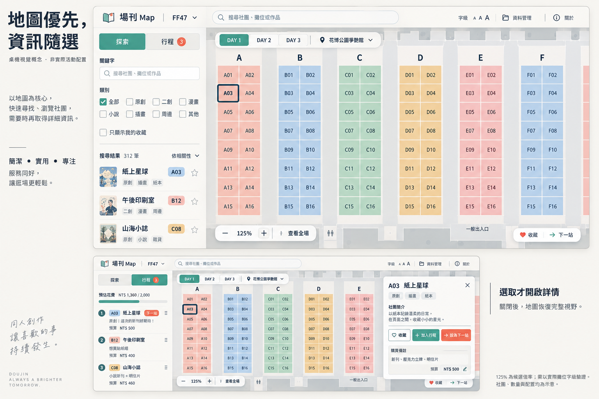

# 地圖視域：驗證與初步視覺概念

2026-09-09 · 歷史概念驗證（後續實作證據見技術規格第 10 節）· 核對基準：工作目錄程式碼，HEAD `9680719`。

原提案：[地圖視域改進方向](./map-viewport-direction.md)。本次交付為視覺概念與文件，不修改正式頁面、契約或 ADR。

**後續決策**：[地圖新介面技術落地規格](./map-viewport-implementation.md)已取代本文的候選方案：首次開啟維持全場 fit，不採 125% 預設或自動定位行程；以可用格子空間調整文字。原概念圖只保留為探索紀錄，純介面結構與狀態規則請讀新規格。

## 結論

「版面回收」與「初始倍率」應分開處理的方向成立，但原文的欄寬、收益試算及可讀性論據不足以直接定案。另須納入第三項：**攤位文字的渲染尺度**。只把預設倍率從 fit 拉高，不能保證代碼可辨識。

## 核對結果

| 原提案 | 核對與修正 |
|---|---|
| 左 248px、右 304px | 這是全域 CSS；實際 workspace 同時套用 CSS Module，一般桌機為 **296px / 330px**，導航模式左欄 **360px**。1180px、1050px 以下另有覆蓋。見 `app/event-map-app.module.css` 的 `.workspace` 與 media queries。 |
| 行程位置尚未處理 | 一般模式右欄下半部顯示精簡行程；導航模式左欄顯示完整行程，右欄只顯示詳情。原文一般模式的空狀態描述成立，但不能套到導航模式。見 `app/event-map-app.tsx` 的 `compactItineraryPanel`、`planningPanel` 與兩側 aside。 |
| fit 同時控制初始化、下限、重設 | 成立。ResizeObserver 也會在原本處於 fit 時重新 fit；拆初始化時必須保留這項 resize 契約。 |
| 145% 就是可讀尺度；與 fit 差一個數量級 | 不成立。145% 是媒體門檻，與約 52% 僅相差 2.8 倍。缺縮圖仍畫一般攤位格。可讀性需獨立評估。 |
| 只回收垂直空間無效，B 必須依賴 C | 只在寬度受限且寬度保持不變時成立。B 還包含移除左右 40px 內距，因此不完全是垂直回收；1920px 情境原本就受高度限制。C → B 可作交付順序，並非普遍數學依賴。 |
| `.map-title` 可刪，保留 h1 | 成立，但須保留活動與場館語意。`.map-title p` 沒有對應 markup；單一子項的剩餘空間本身不證明版面塌陷。 |
| 日期、展區移到浮層 | FF47 不顯示 A–K／L–W 切換；只在活動定義允許時呈現展區。還須安置原 toolbar 的「導航模式」與儲存狀態，不能隨整列刪除。 |
| A 只改一個 effect | 範圍低估：URL 非同步恢復、地圖 scope 切換、resize、使用者已有平移縮放及初始化定位優先序都須協調。 |
| 新 ADR | B/C 改變 `DESIGN.md` 的桌機三區布局，並擴充 ADR-0001 的參考範圍；正式採納時以新 ADR 記錄。現階段仍是提案，不覆寫既有決策。 |

### 實際 layout 與可重算數值

本機 `.event-data/ff47/map.json`：revision 3，2400 × 1696，988 slots，長寬比 **1.415094**。程式將 floorHeight 固定為 950，故 floorWidth 為 **1344.3396**。這是本機快照讀值，**未驗證它是否等於目前線上發布版本**；目前 public staging 是 sample fixture，不能冒稱完成正式 FF47 頁面實測。

以下直接呼叫 `app/map-viewport.ts` 的 `calculateMapFitZoom`，padding 每邊 36px。高度沿用原提案 900px 畫面下 682px 的估值（共扣 218px），欄寬改採 CSS Module。**這是受控尺寸試算，不是 getBoundingClientRect 實測**；邊框、字型載入與實際標題高度尚未計入誤差。

| 螢幕 | 情境 | 地圖可視區試算 | fit |
|---|---|---|---:|
| 1440 × 900 | 現況一般模式 | 774 × 682 | 52.2% |
| 1440 × 900 | B：移除 toolbar、標題及內距 | 814 × 828 | 55.2% |
| 1440 × 900 | C：右欄不佔位，保留原內距 | 1104 × 682 | 64.2% |
| 1440 × 900 | B + C | 1144 × 828 | 79.6% |
| 1920 × 1080 | 現況一般模式 | 1254 × 862 | 83.2% |
| 1920 × 1080 | B | 1294 × 1008 | 90.9% |
| 1920 × 1080 | C | 1584 × 862 | 83.2% |
| 1920 × 1080 | B + C | 1624 × 1008 | 98.5% |

C 以右欄關閉或覆蓋、不擠壓 map 容器為前提。詳情覆蓋時，實際未被遮住的區域會縮小，不能拿容器面積充當有效視野。

### 字級是第三個問題

`app/event-map-renderer.module.css` 的 `.slot text` 為 7px；SVG viewBox 高 1696，而 floor CSS 高 950。一般攤位數字的螢幕字級近似 `7 × 950 / 1696 × zoom`：52.2% 約 **2.0px**、125% 約 **4.9px**、145% 約 **5.7px**。這是名義字級，不是字形可視高度；媒體格的 5.5px 更小。

因此初步概念以 **125% 作為構圖候選**，並以代碼約 **12px 以上**作為待測的視覺目標；兩者不能直接套入現有 renderer。需評估縮放補償字級、依格子空間調整標籤，或提高初始倍率的取捨，且不能讓字溢出遮住鄰格。現有格內只顯示數字、排頭顯示字母；概念圖完整代碼為可讀性探索，不代表已採納。

## 初步視覺概念：地圖優先，資訊隨選

圖片為 imagegen 產生的初步構圖。圖中重複搜尋框、示意分類／排序選项、裝飾文案不納入設計規格；上方 A03 描邊可視為鍵盤焦點探索，下方已在行程的 A03 實作時應顯示對應狀態，不能仍顯示「加入行程」。正式介面行為以以下文字為準。

使用者在桌機上找社團、確認攤位並安排當日行程。延續現有暖紙色、深墨字、低彩度分類色與細邊線；訪客模式為 Operate，以任務效率為主。

- **一列頂部導覽**：活動名稱保留唯一 h1、搜尋取得彈性空間，右側維持字級、資料管理與關於。場館名稱進入地圖浮動位置列。概念以 72px 為目標，較大字級下容許增高，不硬壓文字。
- **左欄 296px**：「探索／行程」兩個桌機工作頁籤共享同一欄。探索容納搜尋篩選與結果；行程沿用既有清單能力，包含排序、購買項目、預算與走訪。這會把一般模式的常駐精簡行程改為可切換入口，是待確認的取捨。頁籤切換不自動進入導航模式，也不清除探索狀態。
- **地圖接到工作區邊界**：日期浮於左上，展區切換只依活動定義出現。底部控制保留縮放及明確的「查看全場」（沿用重設到 fit 的語意）。導航模式入口放在行程頁籤內容；儲存異常在資料管理入口旁持續提示。
- **詳情選取才開啟**：候選為 330px 右側覆蓋面板，關閉後完全消失。選取定位以「未被面板與浮動控制遮住的區域」為中心，保持倍率；詳情不重複顯示行程。桌機不設 modal focus trap，關閉時把焦點還給選取來源。
- **狀態分離**：收藏、加入行程、設為下一站仍為三個動作；圖上以文字或形狀輔助顏色。沒有選取、沒有行程時，不為空白右欄保留空間。初期不加入 minimap。

概念圖中的社團名稱、數量、攤位配置與行程皆為示意，不能作為 FF47 活動資料或空間導航依據；圖片不證明像素尺寸或互動已實現。

### 初始化候選規則

先處理有效 URL 攤位，再考慮當日已明確指定的下一站、當日行程第一站；都沒有時置中。不自動從多個收藏中任選一筆，不把初始化定位寫成新的「下一站」。待 URL 與資料恢復完成後只初始化一次；後續選取不改倍率。跨活動／scope 是否重置必須在實作前寫入契約。

## 後續驗證與邊界

1. 以正式 pinned FF47 資料在 1440 × 900、1920 × 1080 量測 map rect、fit、代碼螢幕字級及實際可見攤位；再評估初始倍率和字級策略。
2. 核對普通、較大與最大字級，以及一般探索／導航、無選取／有詳情、空行程／長行程、長社團名、載入與錯誤狀態。浮動日期、下一站提示、詳情與縮放控制不得互相遮擋。
3. 保留重設到 fit、原本在 fit 時 resize 重新 fit、選取不改倍率、深連結恢復、鍵盤 roving focus、唯一 h1、關閉焦點還原與 reduced-motion。
4. 1050px 以下檢查詳情遮蔽；760px 以下保持現有四頁籤底部工作面板及三段高度，不把桌機兩頁籤搬到手機。
5. 新 ADR 定案後才同步 `DESIGN.md`、元件規格與活動地圖契約。先驗證可讀性，再拆分初始化與版面變更；初步圖不是開工驗收依據。

外部 Comike 數據本次未重新登入量測，保留為原作者觀察，未升級為本次已驗證事實。此設計不依賴其預設倍率先例。
