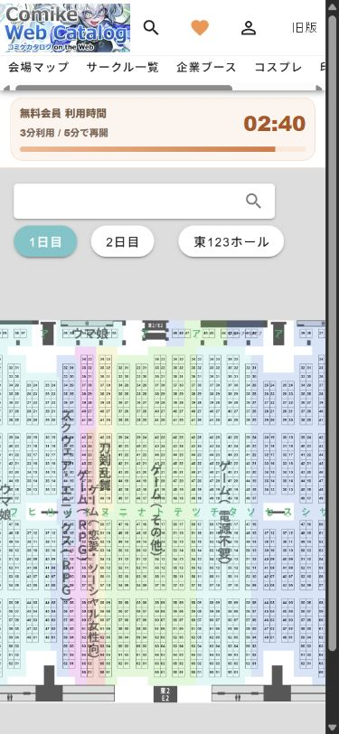
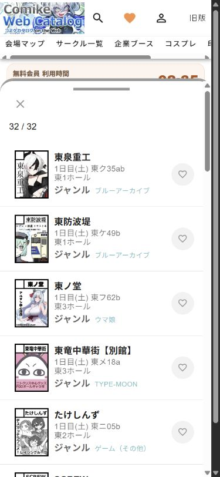
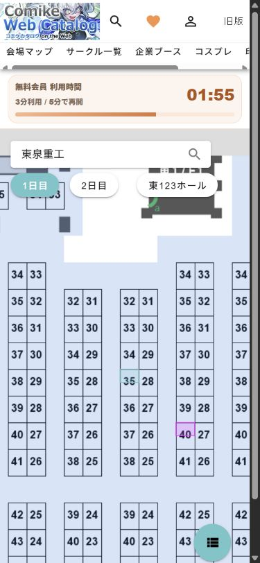

# 手機地圖面板改進計劃

- 日期：2026-09-11
- 狀態：**方案 B 已實作；本機驗收及 issue #202 複核見第 8 節。** 現行決策見 ADR-0056；原規劃保留供追溯。
- 範圍：公開閱讀端手機地圖（≤760px）的面板、搜尋定位與返回流程。桌機只驗證斷點切換不退化。
- 依據：[地圖契約](../contracts/event-map.md)、[桌機規格](./map-viewport-implementation.md)、[ADR-0055](../adr/0055-desktop-map-uses-two-zones-and-overlay-details.md)、[領域詞彙](../../CONTEXT.md)。

## 1. 問題與目標

本次線上 FF47 的 390×844 檢查中，手機地圖起點約 y=345，半開面板頂部約 y=474，兩者之間只有約 129px，還包含縮放與狀態控制。搜尋結果或詳情雖然能操作，使用者卻難以看見選取攤位。關閉詳情後仍留下展開的空白詳情分頁。

目標是讓使用者能完成「找社團 → 看攤位位置 → 加入行程 → 讀完整內容 → 回到原位置」，每次切換都有明確出口。完整閱讀時可以遮住地圖；聲稱在看位置時，選取攤位必須真的可見。

首次仍顯示完整場館。不以提高首次倍率解決面板遮擋，不改 SVG layout、規劃 schema、後端、收藏語意或部署。

## 2. WebCatalog 補驗紀錄

使用現有 Chrome 登入，等待五分鐘後重跑，390×844 視窗。來源：[WebCatalog 地圖](https://webcatalog.circle.ms/map?day=1&hall=e123&category=CIRCLE)。以下截圖是本輪實際捕捉並檢視的畫面。

| 步驟 | 實際操作與狀態 | 評估 |
|---|---|---|
| 1 | 重開地圖，日期、場館與搜尋浮在地圖上，無常駐底部分頁 | 地圖優先；仍有導航捲軸與使用限時橫幅 |
| 2 | 搜尋「東泉重工」，結果面板顯示 32/32，第一筆為該社團 | 結果可操作；搜尋匹配方式未研究 |
| 3 | 點該結果，列表收起，地圖明顯放大定位；URL 帶 wcid=23004668 | 先看位置，沒有立即打開完整詳情 |
| 4 | 再點可見地圖攤位，打開「ゆかりた／東ク34ab」完整詳情 | 面板幾乎遮滿地圖，適合完整閱讀 |
| 5 | 點詳情左上叉號，面板消失，回到同一片放大的地圖 | 搜尋與 wcid 保留，沒有空白詳情面板 |
| 6 | 點右下列表圖示 | 未觀察到面板重新開啟，列為未驗證，不當成成功證據 |

步驟 4 是鄰近攤位，不是搜尋結果的同一社團；因此證據支持「列表定位」和「地圖詳情開關」兩段流程，不宣稱同一社團的全鏈路已驗證。關閉前後以可見攤位排列判斷位置保留，未量測像素偏移。







採納：浮動位置控制、列表與地圖任務切換、關閉後保留位置。不照搬：付費時限、無名稱圖示、以大圖優先擠走基本資料，也不直接採用其搜尋後自動放大策略。本案選取仍保留倍率，先修正可見區定位。

限制：視窗模擬，非手機 User-Agent 或真機；未驗證軟鍵盤、雙指縮放、螢幕閱讀器、完整收藏流程與結果重新開啟。截圖不能證明無障礙合規。

## 3. 方案取捨

| 方案 | 優點 | 代價 | 結論 |
|---|---|---|---|
| A：四分頁不動，只補定位與關閉 | 改動最少 | 詳情仍混在工作分頁，上方佔位仍多 | 不另做過渡版本，修正併入 B |
| B：探索／行程入口＋選取摘要＋完整閱讀面板 | 看位置與讀內容明確分開，延續既有資料及元件 | 需整理面板狀態、焦點和高度 | 使用者已選定，按第 7 節實作 |
| C：仿 WebCatalog，結果定位後再點攤位讀詳情 | 地圖優先 | 增加精準點擊負擔，低倍率尤其困難 | 不照搬二次點擊要求 |

## 4. 選定方案 B

### 4.1 上方與地圖工具

頂部保留活動識別與唯一搜尋輸入；資料管理、字級和使用說明放入有文字名稱的工具選單，儲存錯誤仍需立即可見。移除重複的地圖標題區。日期／場館空間顯示為地圖左上精簡控制；只有可切換時才呈現選單，不把展區和場館空間混用。

導航入口放在行程內；啟用後地圖顯示簡短模式提示與退出操作。下一站與模式提示共用狀態位置，避免疊加兩塊橫幅。

### 4.2 面板狀態

| 狀態 | 內容 | 高度與地圖關係 | 出口 |
|---|---|---|---|
| 看地圖 | 探索、行程入口；有選取時顯示攤位與社團摘要 | 底部精簡 dock，不展示空詳情 | 開探索、行程或摘要 |
| 探索／行程 | 結果、篩選或當日行程 | 預設半開，可完整展開；保留各自捲動 | 明確「回地圖」按鈕 |
| 選取摘要 | 攤位、社團名、收藏、加入行程、下一站、查看完整資訊 | 內容驅動高度；上方必須留下有效地圖區 | 收起回地圖、回結果、完整資訊 |
| 完整閱讀 | 同一社團完整資料與來源 | 高面板／dialog，可遮住地圖，不宣稱同時看位置 | 返回摘要或原來源 |

保留既有三段高度能力，優先重用面板容器，不新增多個重疊底部面板。半開高度不能只按整頁百分比決定：應扣除實際 header、浮動工具、safe area 後再限制高度。

390×844、標準字級的提案驗收目標：選取摘要開啟時，上方連續有效地圖區高度至少 240 CSS px，選取標籤完整可見。此值是本案目標，不是外部標準；360×640／大字級不足時自動採精簡摘要，長內容留給完整閱讀，不壓小文字。

### 4.3 狀態轉移

| 動作 | 目標行為 |
|---|---|
| 搜尋輸入 | 開結果面板，保留 IME 組字，結果更新不搶焦點；不自動清除已選社團 |
| 點搜尋結果或地圖攤位 | 開選取摘要；依真正可見矩形定位；倍率維持不變 |
| 收起摘要 | 保留選取、URL、倍率及位置，回地圖；不留下 disabled 且 selected 的詳情分頁 |
| 回結果 | 恢復原搜尋條件與結果捲動位置 |
| 開／關完整資訊 | 保留摘要上下文；關閉還原呼叫者焦點，不重新 fit |
| 查看全場 | 收起面板，回到 fit；保留有效選取 |
| 加入行程 | 留在摘要，以明確文字回饋成功；不強制切行程 |
| 設為下一站 | 更新下一站，不把開啟導航混為同一動作；目標與摘要顯示一致 |
| 換日期或場館空間 | 按既有 scope 與 URL 契約處理；無效選取關閉摘要，返回有效探索／行程狀態 |
| 瀏覽器返回 | 遵循既有 URL 歷史，不因面板高度變化製造 history 項目 |
| 跨 760px 斷點 | 保留有效選取及規劃，映射到桌機既有詳情；不重跑 scope 初始化 |

### 4.4 可見區與手動操作

沿用桌機的可見矩形概念，量測手機頂部工具、底部控制、dock 和面板實際邊界，換算到 map 本地座標。選取放在矩形中心；面板轉場結束後最多做必要的一次修正。拖曳地圖或縮放應取消待執行定位，不能反覆拉回。

手指拖面板時不連續重設地圖倍率；定位請求只保留最後一筆。無有效矩形時暫緩定位並保持選取回饋，避免 NaN 或跳動。軟鍵盤開啟時優先完成搜尋，收鍵盤後再依實際可見區定位。

### 4.5 無障礙與手勢

- 每個拖曳動作都有按鈕替代：回地圖、展開、收起；觸控目標以至少 44×44 CSS px 為設計目標。
- 非 modal 半開面板不鎖住整頁焦點；完整閱讀若採 modal，使用既有 dialog 焦點管理與 Escape 行為。
- 收起內容須離開可存取樹及 Tab 順序。完整閱讀關閉返回呼叫者；失效呼叫者返回合理的探索／行程入口。
- 選取狀態同時有文字與描邊，不只靠分類色。尊重 reduced motion。
- 面板拖曳從把手起始；內容捲動不誤觸拖曳，地圖雙指操作不傳給面板。

## 5. 分期與驗收

1. **面板狀態與返回**：直接建立方案 B 的狀態與入口，將空白詳情修正併入；不先交付會被 B 替換的四分頁版本。
2. **整理手機資訊層級**：精簡 header 和地圖工具，實作選取摘要與探索／行程入口；保留現有色彩、字級與圖示系統。實作前以現有截圖製作視覺方案供比較。
3. **完整閱讀與真機驗收**：整合完整資訊出口、焦點還原、鍵盤與 safe area；通過後才更新現況契約。

必要矩陣：360×640、390×844、430×932、760px 邊界、761px 桌機，三種字級；另測 iOS Safari／Android Chrome 真機軟鍵盤、旋轉、雙指縮放與面板拖曳。

必要流程：首次全場；搜尋→選取→加入→回結果；地圖選取→完整資訊→關閉；導航→下一站→退出；空結果復原；無效日期選取；URL 恢復；快速重複選取；手動移動取消自動定位。驗收要截取穩定畫面並確認目標可見，不能只驗證按鈕變字或倍率數字。

## 6. 範圍、風險與文件更新

主要落點預期為 `app/event-map-app.tsx`、其 CSS Module、既有視域 controller 與詳情元件；實作前以實際 source 確認責任，不建立另一套規劃 store 或 renderer。

A01／A02 顯示一致性是相關獨立問題：行程仍以社團為單位；先呈現當日適用攤位集合，連號可寫 A01–A02，非連號不可誤壓成範圍。定位需有可解釋且穩定的目標。分類數量口徑另立範圍，不夾帶於面板改版。

本提案將變更 ADR-0055「手機維持原行為」的範圍邊界，定案時需新增手機 ADR，明確取代該限制而保留桌機決策。實作同一變更中更新 DESIGN.md、components.md、event-map 與必要的 URL 行為說明；不提前把提案寫成現況契約。

風險集中在高度量測造成跳動、焦點還原、軟鍵盤及斷點映射；以分期與真機檢查控制。此文件及截圖為計劃成果，沒有修改程式、提交或發布。

## 7. 方案 B 實作工作單

### 7.1 已核對的現況與修改位置

| 位置 | 現況 | 實作內容 |
|---|---|---|
| `app/event-map-app.tsx` | `MobilePanel` 為 filters/results/details/plan；`mobileSheetLevel` 為 peek/half/full | 改成探索／行程入口及獨立摘要狀態，統一搜尋、選取、導航、URL 恢復與斷點事件 |
| 同檔 `closeDetails` | 手機清除 selectedRecordId 並寫 history，沒有切離 details | 收起只改面板，不改選取及 URL；明確清除選取仍由 scope／原有選取操作負責 |
| 同檔 `resetMap` | 只在桌機收起詳情，隨即 reset | 手機先收合，待收合幾何可用後 reset 一次；避免拿半開尺寸計算 |
| 同檔 `mobileSheetSnapPoints` | 92px、44%/420px、82%/760px，依 window.innerHeight | 以實際可見高度、header、工具和 safe area 計算；CSS 與拖曳共用同一份高度結果 |
| `app/event-map-app.module.css`、`app/globals.css` | 手機固定底部面板及舊 header／toolbar | 手機範圍內精簡上方與兩入口 dock，移除被替代的四分頁規則；不影響桌機 selector |
| `app/use-map-viewport.ts` | 手機 measure 返回完整 viewport；桌機已有工具與詳情遮蔽 | 加入手機工具與面板 refs，分開 fit 與選取矩形；延用一次定位與取消機制 |
| `app/map-viewport.ts` | 已有矩形、fit、定位純函式 | 必要時擴充底部遮蔽計算，不建立手機獨立座標系 |
| `app/event-workspace-panels.tsx` | 同一 CircleDetails 支援 compact 與完整內容 | 重用動作與資料來源；新增明確手機摘要呈現選項，避免改壞桌機 compact |
| 同檔完整資訊 portal、`useModalFocus` | 已有 showFullDetail、dialog 與焦點管理 | 直接重用，手機補滿可用高度與返回摘要；不新增 full sheet 狀態與重複詳情 |
| `tests/browser/map-viewport.mjs` 及既有 viewport/component 測試 | 已有桌機與手機基礎檢查 | 保留桌機斷言，增加方案 B 使用者流程與可見矩形斷言 |

### 7.2 最小狀態與不變量

建議將手機轉移收斂到一個小型 reducer（可放 `app/mobile-map-panel.ts`），只管理介面狀態；資料、選取和 URL 仍由原 controller 管理。

```ts
type MobilePanelState = {
  surface: 'workspace' | 'summary';
  workspace: 'explore' | 'plan';
  exploreView: 'results' | 'filters';
  level: 'peek' | 'half' | 'full';
};
```

- `workspace` 保留最後入口，摘要收起不覆寫它；兩入口永遠可用。「篩選」是探索內按鈕，不再是全域頁籤。
- 無有效選取時 surface 必須是 workspace；不允許空摘要。summary 只用 peek／half，完整閱讀統一交給既有 dialog。
- 選取摘要的 peek 顯示社團與攤位，可點回 half；workspace 的 peek 只顯示探索／行程入口。
- 拖曳摘要到 full 的手勢不直接開 dialog，避免拖曳意外換模式；完整資訊由明確按鈕開啟。
- reducer 不持有 CircleRecord、倍率、DOM ref 或規劃資料。full dialog 沿用 showFullDetail，不再複製一份狀態。
- 探索／行程各自保存捲動位置，探索內結果／篩選也分開；活動切換重置，日期切換行程回頂，結果依新查詢回頂。

### 7.3 精確事件行為

| 事件 | 面板／焦點 | 資料與地圖 |
|---|---|---|
| 開探索／行程 | workspace + 對應入口 + half；重點同一入口可收回 peek | 保留選取與倍率，不自動定位 |
| 搜尋變更 | explore/results/half，焦點留輸入 | 與桌機一致退出導航但保留行程；原 onChange/IME 行為保留 |
| 選結果或攤位 | summary/half；記錄來源與返回焦點 | 原 selectRecord 更新選取後，等待摘要穩定尺寸再定位，不變倍率 |
| 收起／回地圖 | 當前 surface/peek；焦點到摘要重開按鈕或 dock | 不清選取、不 push history、不移動地圖 |
| 摘要回結果 | explore/results/原有效展開高度 | 恢復結果捲動，不重新執行搜尋 |
| 完整資訊開／關 | 原 dialog 管理焦點；關閉回摘要觸發按鈕 | 不 reset，不另寫 URL |
| 清除或失效選取 | 若在 summary，回最後 workspace/peek；關閉失效 dialog | 遵循原 scope 及 URL codec，不保留過期 record |
| 啟用導航 | 有目標則 summary/half，無目標則 plan/half | 導航與下一站仍獨立；不清探索條件 |
| 退出導航 | 回原探索投影，保留當前有效 surface | 不強制 fit、不改已選倍率 |
| 跨斷點 | 手機有選取映射 summary；無選取映射最後 workspace；桌機沿用原兩欄 | 關閉未完成拖曳，取消舊定位；同 scope 不重新初始化 |

### 7.4 幾何規則定案

選取定位與 fit 必須分開量測。選取矩形扣除「現在」的工具、控制器和面板；fit 則以「面板收起」的固定工具／dock 為基準，讓完整場館在首次與查看全場都可見。面板開關不改最小倍率，完整資訊 dialog 不參與地圖 fit。

這會擴充目前手機 fit 使用整個 map viewport 的契約，需在實作時明列更新；仍保持首次全場語意，不採固定倍率。可重用桌機獨立測量工具的做法，但若收合 dock 高度可直接可靠測量，不增加無必要的鏡像 DOM。

ResizeObserver 觀察 map、頂部工具、控制器與面板；面板拖曳只更新展示高度，結束且尚有有效定位請求才重定位。手動 pan/zoom 清掉請求；transitionend 與 reduced-motion 無轉場情況均可完成定位，不只依賴固定 timeout。

半開摘要在 390×844 標準字級保留至少 240px 有效地圖。若小螢幕／大字級做不到，縮成「社團＋攤位＋完整資訊」摘要，收藏／行程操作可在展開內容使用；不縮小字體、不用內層水平捲軸塞按鈕。240px 是驗收設計值，完整閱讀狀態不受此限制。

### 7.5 提交單元與依賴

依序完成並在同一方案 B PR 整合，不單獨發布中間狀態：

1. **狀態與工作面板**：最小 reducer、兩入口、探索內篩選、摘要與收起／返回；移除舊 details 分頁路徑。加入純轉移測試與回歸重現。
2. **版面與可見區**：手機 header／浮動工具、單一高度計算、viewport refs、fit 與選取定位、手動取消。完成 390×844 實際流程，驗證 240px 目標。
3. **完整資訊與邊界**：重用 dialog、焦點還原、safe area、鍵盤及斷點映射；測完整資訊不跳回 fit。原資料管理與工具選單不能失去入口。
4. **整合與文件**：執行驗收矩陣，更新新手機 ADR、DESIGN、components、地圖契約及必要 URL 說明；新增 ADR 時取下一個可用編號，不預占。

不額外實作方案 A。多攤位代碼、分類計數各有獨立驗收與變更範圍，不在此 PR 重做規劃模型；若阻擋摘要正確顯示，僅修正必要的顯示映射並在 PR 明列。

### 7.6 開工與交付檢查表

- [ ] 實作以第 4 節資訊結構與既有設計系統為準，先完成簡要摘要／完整閱讀的畫面規格；不再重新選 A/B/C。
- [ ] 轉移測試涵蓋搜尋、關閉、無效選取、導航、URL 恢復與斷點，不測 reducer 私有實作細節。
- [ ] 幾何測試涵蓋底部遮蔽、零尺寸、面板收合 fit、手動取消與最後一筆定位。
- [ ] 瀏覽器測試確認目標 rect 在實際可見區、關閉後無空面板、結果捲動恢復、完整資訊焦點還原。
- [ ] 360×640、390×844、430×932、760×844、761×844，三種字級；桌機 1440×900 回歸。探索／摘要／完整資訊／行程逐一檢查。
- [ ] 真機 iOS Safari 與 Android Chrome：搜尋軟鍵盤、面板內容捲動、把手拖曳、雙指縮放、安全區與旋轉。設備不可用時明列未驗證，不宣稱完成真機驗收。
- [ ] 按專案 runbook 執行測試、lint、TypeScript 與文件連結檢查；純文件階段不跑應用測試。
- [ ] 交付包含穩定截圖、已通過與未驗證項目、scope 風險。提交前報告 diff 摘要；部署不在此計劃範圍。

完成定義：四分頁詳情模式已被方案 B 取代，手機可完成找社團→看位置→加入行程→讀完整資訊→回地圖，無空面板與遮住目標的錯誤；桌機、URL 與規劃資料行為通過回歸，未驗證項目明確列出。

## 8. 實作與驗收紀錄（2026-09-12）

方案 B 已依選定參考圖完成本機實作；最終採重用既有面板狀態與工作入口記憶，沒有另建 reducer。第 7 節保留開工時的規劃，實際決策以 [ADR-0056](../adr/0056-mobile-map-uses-workspace-and-selection-summary.md) 為準。

完成本機驗收後另依使用者要求讀取並複核 [issue #202](./issue-202-verification.md)；仍有把手、導航目標及測試等缺口，尚不能宣稱所有計劃條件完成或可合併。

已完成手機兩入口、獨立摘要、完整資訊 dialog、可見區與穩定 fit、URL 保留、結果捲動恢復及桌機回歸。623 項測試、lint、TypeScript、正式建置通過；12 組手機尺寸／字級及 6 組桌機矩陣已檢查。具體證據、截圖與未驗證項目見 [design-qa.md](../../design-qa.md)。真機 iOS／Android 項目仍未完成，不將第 7.6 節所有規劃項目一概勾選為通過。
