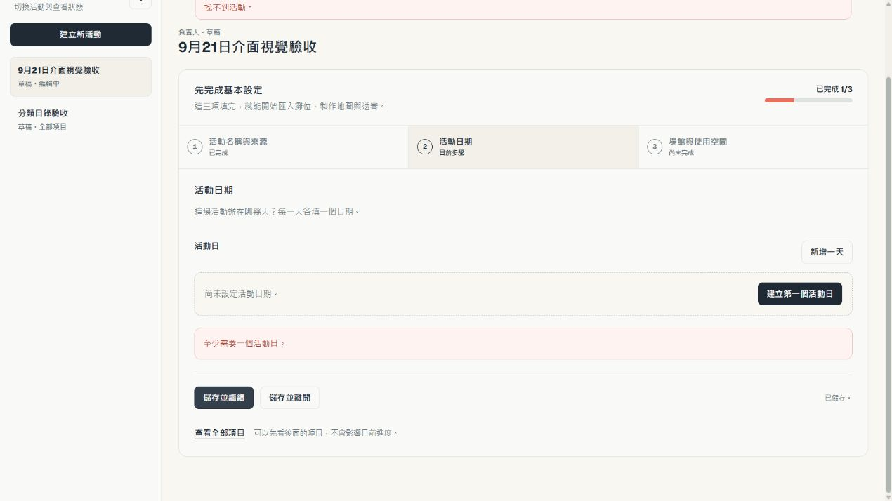
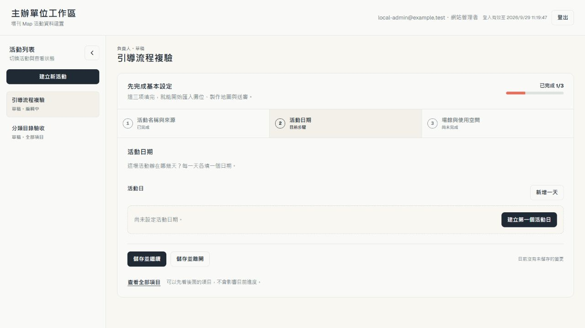
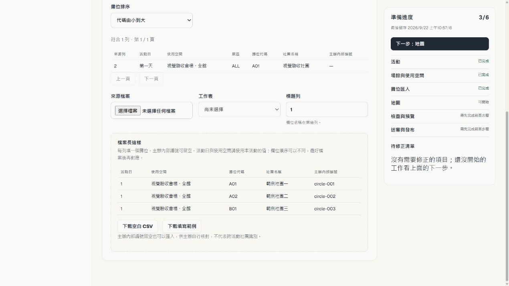
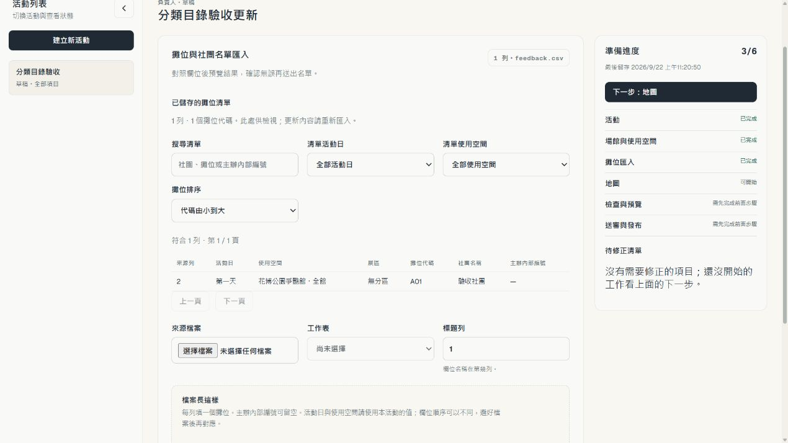
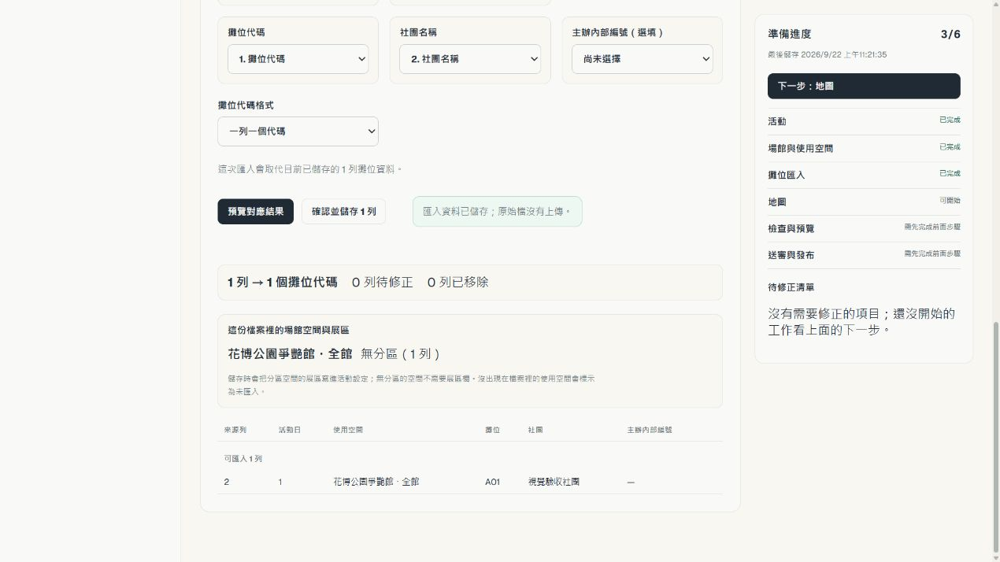

# 9/21 結案介面變更視覺驗收

驗收日：2026-09-22（Asia/Taipei）。範圍是 2026-09-21 關閉的 12 張 issue：其中 10 張使用者介面行為、#224 結構重整一併回歸、#303 測試修正以 browser suite 驗證。

基線 `f70bbe9`；修正實作 `4f8e84c`。在本機 Pages Functions、D1、R2 測試環境使用管理者／負責人及協作者帳號操作，沒有修改正式候選或發布活動。手動操作使用 Codex in-app browser，1270×714；另以 900×900 檢查桌機限制。本文圖片均為此次保存並檢視的原始畫面，未合成 UI。

## 任務流程與涵蓋範圍

| 步驟 | Issue | 實際操作與觀察 |
| --- | --- | --- |
| 1. 建立並續做活動 | #221、#224 | 新建活動，填官方來源、主辦與分類；儲存並離開後續做；第一天不預填日期；進度只計已存內容；完成三步後只保留一套六區導覽。修正下一步繼承錯誤／成功狀態。 |
| 2. 建立場館與選擇空間 | #219、#222、#298 | 必填欄位在表單內說明；空間網址留空沿用場館網址；新增空間的場館／空間皆未選，儲存停用並說明。閱讀 FF47／CH20 範例後，改正與表格矛盾的說明。 |
| 3. 匯入及校對名單 | #225、#294 | 檢視範例；匯入 12 列排號 A/B 與攤位前綴一致的資料，顯示非阻擋提醒；使用「前往場館與使用空間」改為無分區，再匯入 A01。正常列沒有移除操作；修正內部 ALL 與成功回饋消失。 |
| 4. 建立地圖 | #218、#220 | 空白地圖的建立鍵停用並具名說明；畫入 A01 後可存，顯示成功且編輯器保持開啟。 |
| 5. 檢查及預覽 | #220、#223 | 執行檢查、產生預覽；另建只有柱子的地圖，重現缺 A01 的錯誤。錯誤卡／側欄使用相同人類用語，列出來源檔、社團、列號與修正路徑。修正檢查與預覽的兩則成功訊息共存。 |
| 6. 角色及視窗限制 | #217、#224 | 在本機郵件接收器邀請協作者並登入，確認送審／協作者管理等動作仍可見、停用且有角色原因。900px 寬只顯示桌機提示。 |
| 7. 自動化回歸 | #303 | 完整 browser gate 發現固定 9/15 測試資料與真實瀏覽器日期不一致，9/22 起觸發前端登入到期；讓這支 journey 的瀏覽器時鐘與 handler／session fixture 一致。沒有修改 timeout、正式登入期限或削弱檢查。 |

## 發現、修正與複驗

| 發現 | 影響／處置 | 複驗 |
| --- | --- | --- |
| 已失效的本機續做活動觸發「找不到活動」，留到新活動 | P2；#220。先核對可見清單，活動讀取離開後忽略舊回應；導航／新建清除工作區通知。 | browser journey 注入不存在的記憶活動，確認不發出 detail 讀取、無錯誤殘留。 |
| 下一個引導任務一打開就紅字，且顯示上一任務「已儲存」 | P2；#220／#221。依任務切換表單生命週期。 | 實際從完整的名稱／來源前進到尚未填寫日期，保持中性。 |
| 建置冊儲存活動、場館、匯入後成功訊息瞬間消失 | P2；#220。可編輯面板不隨版本重新建立；已存正規化資料同步回乾淨表單。 | 連續儲存、修改後清除回饋、匯入再存均通過；延遲儲存期間鎖定編輯，refresh 失敗後仍可重試。 |
| 無分區仍顯示 ALL | P2；#225。依空間的分區模式轉譯清單、摘要與混合空間的有效／待修正列。 | 無分區顯示中文；真的 imported ALL 保留原名稱。 |
| 場館範例正文說同一場館，表格卻是兩個場館 | P3；#298。改成依活動官方公告判斷是否分區。 | FF47／CH20 表格與正文一致。 |
| 建立預覽後還留著「檢查完成」 | P2；#220。兩個動作開始時清除上一動作回饋，等待期間不能重複發動。 | 畫面只留「預覽已產生」。 |

### 引導：上一任務的狀態不再出現在新任務

修正前：

修正後：

### 匯入：結果留在按鈕旁，無分區使用中文

修正前的清單：

修正後的清單及儲存結果：

### 其他操作證據

- [未選空間與停用原因](assets/organizer-2026-09-21/07-unselected-space.png)
- [排號／展區非阻擋提醒](assets/organizer-2026-09-21/09-import-row-warning.png)
- [空地圖不能儲存](assets/organizer-2026-09-21/12-empty-map-disabled.png)
- [有內容的地圖儲存後仍可編輯](assets/organizer-2026-09-21/14-map-saved.png)
- [協作者停用動作與角色說明](assets/organizer-2026-09-21/19-role-disabled.png)
- [900px 桌機限制](assets/organizer-2026-09-21/20-narrow.png)
- [預覽回饋修正前](assets/organizer-2026-09-21/16-preview.png)／[修正後](assets/organizer-2026-09-21/21-preview-feedback-fixed.png)
- [場館範例修正後](assets/organizer-2026-09-21/22-venue-guide-fixed.png)
- [場館儲存回饋](assets/organizer-2026-09-21/23-venue-save-fixed.png)
- [缺攤位錯誤卡、來源與側欄](assets/organizer-2026-09-21/27-validation-human-copy.png)

## 工程證據與邊界

- Node 24.20.0／npm 11.19.0；`npm ci` 成功。
- 全部 854 個 Node 測試以 `node --test --test-concurrency=1 --test-reporter=spec tests/*.test.mjs` 通過，0 skipped。首次 `npm test` 的 Windows 多程序執行遇到 `EADDRINUSE`；完整同一集合改為序列執行，CI 仍執行原始 gate。
- ESLint 全專案通過，僅在本機命令排除既有 `.tmp/**` 及 `workers/publication-dispatch/.tmp/**` 產物；repository lint 規則未更改。`tsc --noEmit --incremental false` 通過。
- 延伸既有 `portal-organizer-references` 及 `portal-organizer-import` journeys，分別 11／6 個截圖檢查通過、無 page errors；包含儲存期間停用、refresh 失敗後重試、連續儲存、混合空間與合法 ALL。
- 完整 browser run 中 20 支 journey 通過，唯一失敗為 #303 fixture 日期與瀏覽器時鐘不一致。同步該測試時鐘後，amendment publication 單獨重跑 6 個檢查通過，涵蓋核准、失敗與重試完成。Session expiry 的 10 個檢查也已通過；沒有放寬正式期限。
- 獨立 reviewer 初審 `f380400`，發現兩個儲存期間編輯／版本回退 blocker；於 `4f8e84c` 聚焦驗證完成，blocker 為零。只進行一輪必要修正。
- 完整 browser suite 與 required CI 的最終結果記於交付 PR。

這是指定 issue 的任務式視覺與操作驗收，不是完整 WCAG 認證、所有裝置／瀏覽器矩陣，或新的正式活動發布驗收。未變更 schema、binding、權限、公開資料 pin 或發布流程；PF45 既有展區資料沿用 #294 已結案處置。沒有待維護者決定的產品選項。
