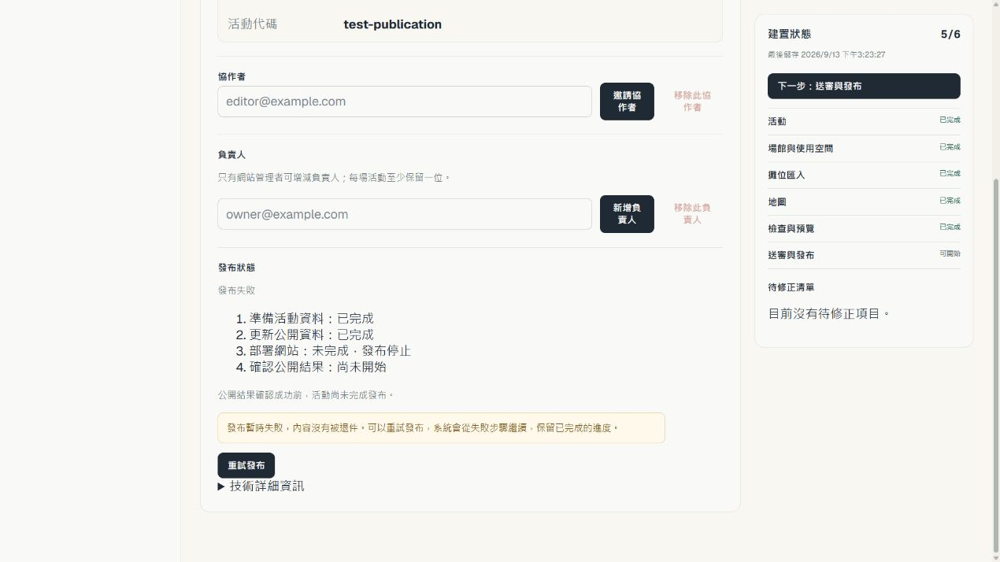
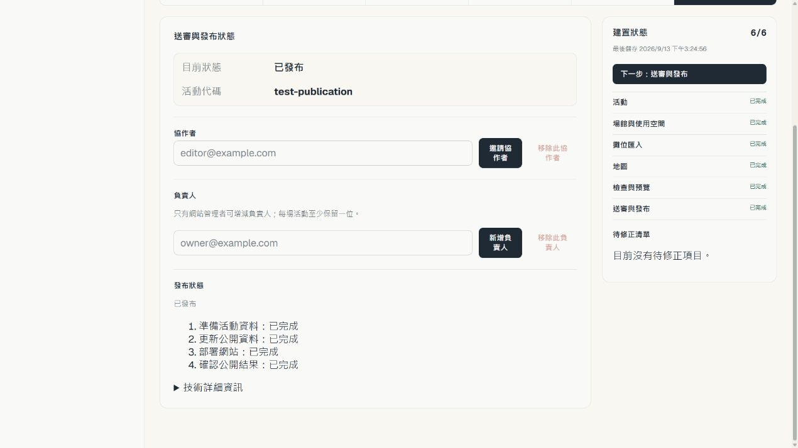

# #212 發布條件驗證（2026-09-13）

結論：**No-go：不能啟用正式自動發布，也不能把 ch-20 標為 published。** 本次 PR 提供發布核心、恢復與 UI 閘門；尚未完成 production adapter 與真實 end-to-end 驗收。#212 保持開啟。

## 正式環境：本次實際觀察

1. 從 `https://tw-catalog.pages.dev/organizer` 正常登入，活動列表可以找到 Comic Horizon 20。活動代碼 ch-20，狀態「已核准」，內容表單鎖定。入口可達性通過。
2. 點「送審與發布」看到「等待發布／整理資料」，没有可執行的發布或恢復動作。同頁卻顯示 6/6、送審與發布已完成。此處未完成發布，且成功提示會造成誤判。
3. Reader 正常入口目前顯示 Fancy Frontier 47；repository 的 published collection 只有 ff47。未取得 ch-20 公開 event/catalog/map smoke 成功證據。

正式 screenshot 保存於本機 `.tmp/issue-212/01-ch20-queued.png`；含登入帳號資訊，未加入公開 repository。原始觀察只證明目前畫面，不能回推先前建立、匯入、送審、自我核准或實際發布履歷。

## GitHub 發布閘門

以 `gh api` 實讀兩個 repository 的 ruleset 詳情及 main branch effective rules；不是只讀 enforcement 摘要。

| Gate | 實測結果 |
|---|---|
| main ruleset `22001248` | active，但只有 deletion / non_fast_forward；缺 PR 規則及 Verify and deploy、Full preview portal E2E、Organizer publication approval |
| data ruleset `21704741` | active，要求 PR 與 data / check；缺 Organizer publication approval |
| bypass actors | 上述兩份清單皆空，但 App installation、權限、身份與實際 merge 仍未驗證 |
| production feature flag | 本次未開啟；程式預設 disabled；沒有 dispatcher 時核准仍回 503 |
| production D1 唯讀 | 現有 Wrangler 身分收到 Cloudflare 7403（無權存取）；不以 SQL 直接操作 ch-20 |

API 語意依 [GitHub rules 文件](https://docs.github.com/en/rest/repos/rules#get-rules-for-a-branch)：branch rules endpoint 回傳該 branch 適用的 active rules。rollout evaluator 額外檢查 App 身份、PR 與 required checks；不能只因 active 就通過。

## 本次實作與驗證範圍

- 核准、唯一 job 建立及 candidate publishing 在同一 D1 batch；未接線時拒絕核准，保留 submitted，避免再建立永久等待的 job。
- executor 每次推進一個步驟；保存 PR / head / merge / workflow metadata，immutable snapshot 不符或 CREATE collision 時 fail closed。
- D1 測試涵蓋 main failure 後保留 data、production smoke failure 後保留 main、pending checks、snapshot bytes 被改、collision 不可 retry、同一 job retry、未有 smoke 成功不可 published。
- handler 測試涵蓋 gate disabled 時沒有核准副作用、核准自動 dispatch、Owner 可以 retry 而 Editor 不可 retry。
- UI 一般訊息與技術錯誤分層；發布前為 5/6，failed 不當作內容退件，retry 保留已完成階段；重新登入可回原 candidate。

## 本機 browser journey（模擬 API，不能取代 production acceptance）

使用實際 build 的 Organizer bundle，fixture 名称明示「本機模擬」。操作從 `/organizer` 及活動列表開始，不直接呼叫 retry API、不開 job URL、不檢查 React state。

1. 正常入口可見待審活動、5/6、核准即公開的說明、自我核准提示及「核准並發布」按鈕。通過本機 UI 檢查。
2. 點核准後可見四個人類可理解的階段，確認結果前保留未完成提示。通過本機 UI 檢查。
3. 模擬 deployment failure，重新載入工作區，仍能找到活動、失敗階段、已完成的資料階段及「重試發布」。通過本機 UI 檢查。
4. 點重試後保留已完成階段；模擬 smoke 成功後才顯示 published 與 6/6。通過本機 UI 檢查。

下圖僅證明 UI 呈現，遠端 job、deployment 與 smoke 均為模擬。

可及性：狀態用文字呈現，不只靠色彩；進度區使用 polite live region；審閱欄具 accessible name。未完成螢幕閱讀器、完整鍵盤與對比度合規驗收。管理協作者表單仍在發布狀態之前，較短視窗需要向下捲動才能看到發布動作。

## 尚未通過／後續必要實作

1. Production `PublicationDriver`：snapshot → data/reference/identity/pin artifacts，App token 取得、App-owned PR 建立與 reconciliation、allowlist、required checks、expected SHA merge。
2. Durable dispatch 與 webhook → job 推進，包含無使用者停留頁面時的可靠續跑、legacy ch-20 原 job 恢復。
3. Deployment run 對應、失敗 rerun、Pages production origin event/catalog/所有 map/Reader smoke，以及 custom domain advisory。
4. 兩份 ruleset 補齊並以已安裝 App 實測；通過前維持 production mode 關閉。
5. 使用 ch-20 原 immutable snapshot 完成實際 publication 與至少一次真實可恢復 failure；再跑正常產品入口 → Reader 的 browser journey。

本次没有手動修改 production 資料、merge、部署或替 ch-20 新增 secret。這是維護實作紀錄，**不是**「正常發布所有人工操作為 0」的驗收證據。
