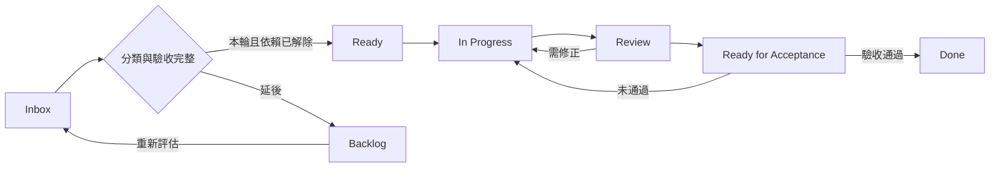

# 專案工作流程：以可交付目標挑選與完成工作

本流程用於新 issue 分類、挑選下一張票、處理 review 衍生工作與里程碑驗收。產品範圍依 [PRODUCT.md](../../PRODUCT.md) 與 [ADR-0041](../adr/0041-scope-is-bounded-by-shippable-features.md)；本文件管理排程與交付證據，不新增產品能力或取代既有契約。

## 1. 先固定本輪目標

目前目標：**一名未接觸 repository 的 Organizer，透過 UI 完成第二場真實活動首次發布；Maintainer 只做必要審核，System 完成發布，Reader 能讀到正確活動。**

目標追蹤面是 [#104](https://github.com/dekkmarsvin/tw_doujin_event/issues/104)，發布實作與驗收集中於 [#212](https://github.com/dekkmarsvin/tw_doujin_event/issues/212)。每次開工先讀最新 issue 與 comments；文件中的票號是路由，不是即時進度。

```powershell
gh issue view 104 --comments
gh issue view 212 --comments
gh issue list --state open --limit 100 --json number,title,labels,assignees
```

**完成範圍差異（2026-09-14 核對）：**分享對話建議首次發布後關閉 #104，但 #104 現有完成目標仍包含至少一次發布後更正。本輪可先完成首次發布里程碑；關閉 #104 前，必須完成其全部驗收，或由維護者明確決定將更正驗收移交 #190 並更新追蹤票。不能僅因本文件把 #190 排在下一階段就關閉 epic。

## 2. 新發現先分類，再決定是否排入

依序回答，將答案寫進 issue 的「目標與排程」段：

1. 對應哪一條 Core User Task？不處理會在哪個真實操作步驟失敗？附輸入、重現方式或缺少的必要能力。
2. 它是否阻止本輪正常流程或既有必要發布 gate？若有可行 UI 路徑，記錄該路徑與代價；僅有優先級或 review 評分不足以證明 blocker。
3. 修正提供使用者能力，還是解除該能力的技術限制？
4. 哪張票已承擔同一完成條件？有重疊時指定一張主票，以 checklist 或 child issue 保留驗收與依賴。

| 工作分類 | 判定 | 排程方式 |
| --- | --- | --- |
| Critical Feature | 本輪正常流程缺少必要的使用者能力 | 加入本輪，寫出受阻步驟與驗收 |
| Critical Architecture | 必要能力因資料模型、發布機制或既有必要 gate 無法完成 | 加入本輪，連到被阻擋的功能與最小解除條件 |
| Next | 有明確正常使用價值，但本輪仍可完成 | 下一階段再選入，記錄重新評估時機 |
| Edge / Hardening | 少見例外、推測性加固，或尚未證明阻擋目標的效能、維護與文件工作 | 留待 triage，記錄觸發條件 |

新 issue 預設不加入 critical path。分類取決於證據，不能僅因標題含 security、architecture、文件或 P1 就決定排程。真實驗收證明會阻擋正常流程，或違反現行必要 gate 時，回到上述四問重新分類；必要檢查失敗不能用「CI 品質」為由跳過。

合併重疊工作時，在主票保留原票連結與驗收條件。被吸收的票只有在承接位置已建立且獲授權時才關閉為 superseded；這不代表功能已完成。

可直接貼入 issue：

```markdown
## 目標與排程
- 目標／主票：
- Core User Task：
- 分類：Critical Feature / Critical Architecture / Next / Edge / Hardening
- 阻擋證據：操作步驟、實際結果、預期結果或缺少的必要能力
- 不處理時的可行路徑與代價：
- 依賴／重複票及承接位置：
- 非目標：
- 驗收：
  - [ ] 可觀察到的完成條件
- 重新評估時機（延後工作填寫）：
```

## 3. 分類與進度分開記錄

沿用 [五個 triage 標籤](../agents/triage-labels.md)：它們描述待評估、待補資料、可交付代理人／人類或不處理。`ready-for-agent` 不代表本輪 blocker；工作分類也不代表已可開工。

先在 issue 內文記錄分類與進度即可。若使用 GitHub Projects，將「工作分類」設為獨立單選欄位；Status 採以下流程：



`Critical Feature` 與 `Critical Architecture` 是並列分類，沒有固定先後。阻塞中的票保留所在進度並寫出 blocker 連結；依賴維護方式依 [issue tracker](../agents/issue-tracker.md)。

## 4. 每次只推進一個可驗收工作

1. **選票**：從本輪 critical path 中選一張規格完整、依賴已解除的票；確認 assignee 與既有 PR，避免重複實作。#222 這類建議提前修的票，仍須記錄選入理由，不自動成為發布 gate。
2. **實作**：依 [domain 查找規則](../agents/domain.md) 讀受影響契約與 ADR，先固定驗收與非目標，再做最小必要變更。完成標準是每項驗收都有實作或明確未完成原因。
3. **驗證與 review**：依 [本機開發與驗證](./local-development.md) 完成適用 gate；UI 變更需在真實瀏覽器操作並留下結果。提交前報告工作樹、diff 摘要與風險。PR 對應主票、契約、驗收證據與範圍邊界。
4. **處理發現**：依 [review-fix loop](../agents/review-loop.md) 判定與修正；自動 review 的觸發保持手動、按風險判斷。範圍外發現回到分類，不自動擴充主票。觸發該文件停止條件時交回維護者。
5. **交付**：實作票按自己的驗收完成；依賴部署或真實活動驗收的票，在相應證據到齊前保持待驗收。合併 PR 不等於本輪目標達成。

GitHub 發文、改票與關票在使用者已授權的範圍內執行；未授權時先準備可貼上的分類與驗收內容。本流程本身不授權發布留言、開啟 production flag 或部署。

## 5. 第二場活動的實作佇列

### 排程基準與下一步

2026-09-14 核對 GitHub open issues、#212 最新工程盤點與本機 `a68524b`。目前沒有 open PR；#228 的 queued timeout 與 checkpoint 文案已由 #231／#238 落地，剩餘 durable recovery 與真實驗收仍未完成。以下是**尚待執行的順序**，不是完成紀錄。每次開工核對新 PR／issue 決策，跳過已有完成證據的工作。

**下一張實作票是 #213。** 先讓真實攤位資料正確，才固定 #244 的產檔格式。#242、#246 的待決策項在各自實作前定案；可先準備決策，但不阻塞 #213。

按目前單人維護方式，一次推進一張實作 PR；下表的數字是預設執行順序，「必要前置」才是技術依賴。遇到決策或外部設定等待，可移往前置已滿足的票，不必空等。

| 順序 | 工作／歸屬 | 必要前置 | 本次交付與離開條件 |
| --- | --- | --- | --- |
| 1 | **#213：攤位群組與匯入** | 無；先固定模型與舊資料讀取策略 | `codes[]` 貫穿匯入、authoring scope、snapshot；CH20 原始 170 列展開 202 碼，儲存後清單可查看，FF47 投影不變。依原票完成模式確認、形狀提示與文案，不順帶做 #214／#215。 |
| 2 | **#242：失敗候選可回編輯** | 先定案下方內容修正決策；#213 合併後做整合驗收 | UI 可明確退回修改，重新 validate／submit／approve；舊核准與 job 保留可追溯紀錄且不再能發布舊內容。基礎設施失敗仍不自動退件。 |
| 3 | **#222：場館必須明確選擇** | 無，可在第 2 步決策等待時先做 | 未選場館顯示真正的空值，不能靜默存第一個場館；實際操作新增使用空間驗證。本輪選入是為降低重建 CH20 地圖時存入錯誤場館的風險，仍屬 SHOULD，不新增硬性發布 gate。 |
| 4 | **#243：GitHub App token** | 現有 App 設定可供驗證 | Workers runtime 可簽發／更新 installation token，完成一次授權範圍內的唯讀 API 實測；憑證不流入 log 或瀏覽器。 |
| 5 | **#244：snapshot 產出發布檔案** | #213 的 snapshot 模型 | 分別生成 data 檔案與帶 data merge SHA 的 main pin；相同輸入產出相同 bytes，通過既有 schema／allowlist，保留既有 published events。 |
| 6 | **#245：production driver 與注入** | #243 + #244 | 實作各 stage adapter、checkpoint 與 reconcile，接入 portal dispatcher；重入不重建 PR／重複 merge，disabled 維持不可發布。真實 smoke 尚未完成時不能回報 productionVerified。 |
| 7 | **#241：webhook 路徑可達** | 無，可在前面工作等待時先做 | 豁免僅限指定 webhook POST 的 Origin 檢查，保留 JSON 與 HMAC 驗證，其他 API 行為不變；在啟用的隔離測試中證明請求到達簽章驗證。 |
| 8 | **#246：自動持續推進**，連同 #235／#236／#228 剩餘工作 | #245 + #241；先定案下方 dispatch 決策 | 無人開工作區也能跨過所有 waiting 階段；漏送／重送可恢復、並行 delivery 受既有 lease 約束；逾時掃描移出讀取路徑，dispatch/backoff 與 15 分鐘契約一致。 |
| 9 | **#237：釐清並修復 browser 驗收失敗** | 無，可在前面工作等待時先做 | 先判斷 preview 資料錯誤或測試等待問題，再修對應原因；以原失敗 journey 與 CI 證據驗證，保留正確內容斷言，不靠重跑變綠或增加固定 sleep。 |
| 10 | **#227（甲）：必要 Browser acceptance check** | #237 | 加入 `PUBLICATION_REQUIRED_CHECKS.main`，驗證同一 PR head SHA 的成功結果才可放行；失敗、pending、skipped 均不能視為通過。（乙）bypass 報告擴充不包含於此交付。 |
| 11 | **#212 Phase 4：真實 deployment／smoke adapter** | #245；整合驗收需 #246 + #227（甲） | 綁定本次 main merge 的部署與 workflow，Pages production origin smoke 成功才標 published；部署或 smoke 失敗可恢復原 checkpoint。custom domain 仍為 advisory。以 #212 承接，避免成為無主的最後一段。 |
| 12 | **#212 Phase 6：部署、修正 CH20、啟用與驗收** | 1–11 的必要交付與發布前置通過 | 按下方順序處理真實候選，完整 UI 首次發布及一次真實可恢復 failure/retry 都有證據，第 6 節人工技術操作達標。 |
| 13 | **#190：已發布更正 → #104 結案** | 第 12 步首次發布完成 | 實作 amendment 並完成一次更正驗收，再核對 #104 全部完成條件；若更正另行移交，依第 1 節先取得明確範圍決策。 |

第 6 步驗的是 driver 與注入，第 8 步驗的是無人操作時仍會被再次叫醒，第 11 步驗的是真實公開結果。fake driver 的 published 只能證明接線；三者不能互相替代完成證據。#245 同時列出 verifying_production 介面又將真實 smoke 排為非目標，實作 PR 需明列此分界，由 #212 Phase 4 接手。

### 兩個實作前要收斂的決策

- **#242，先於第 2 步：**定義誰可退回、fresh session、狀態轉換、eventId 鎖定與舊 job 失效方式，並在契約／必要 ADR 區分「人工內容修正」與「基礎設施失敗自動退件」。必須回答已有遠端 checkpoint 的 job 是否可退回；以 CH20 的無 checkpoint 情境起步時，明確拒絕不支援的情境，不推定所有 failed 都可安全編輯。
- **#246，先於第 8 步：**定義 webhook 與兜底排程的責任、Worker 歸屬、週期／最大 backoff，以及 #235 掃描搬移、#236 逾時語意。建議先評估 webhook 加獨立排程 Worker；此為待定方案，不是已接受 ADR。這個排程只推進已核准 job，不新增 scheduled publication 產品功能。

### 第 12 步的操作順序

執行前先排定第 5 項的受控 failure/retry 情境、環境與授權範圍，避免首次 CREATE 成功後才發現缺少可用驗收情境。

1. 部署已驗證的編輯／匯入修正與發布實作，production publication 先維持 disabled。依 #212 的 2026-09-14 實測紀錄，CH20 的舊 snapshot 有 32 個合併代碼；執行前重新讀取狀態核對，本次排程未重新查 production D1。
2. 透過 #242 的 UI 打開 CH20，依 #213 重新匯入並重建／核對 202 格地圖，確認場館、日期與 Reader 預覽，再送審。**此時不重試舊的錯誤 snapshot，也不先核准。** 舊 job 的停用須由 #242 的已驗證流程完成，不手改 production D1。
3. 核對 ADR-0058 §4 的啟用前置與第 11 步驗證結果，準備並依既有授權流程交付啟用設定 PR。目前 `wrangler.jsonc` 的部署會覆寫 dashboard vars；把 `ORGANIZER_PUBLICATION_MODE` 納入版本控制的設定與部署驗證，不能只在 dashboard 臨時切換。
4. 確認新 revision 是待核准內容後，管理者按「核准並發布」，觀察自動 data → main → deployment → smoke → Reader，按第 6 節記錄證據。
5. 在已授權的測試範圍驗證一次真正的可恢復 publication failure；保留相同 job／snapshot 與 checkpoint 的重試證據。若正常發布沒有失敗，另行安排受控驗收，不能拿歷史 queued timeout 或 fake 測試代替。故障情境需在執行前確定，避免成功 CREATE 後才嘗試用相同 eventId 再建立首次發布。

第 1–3 步屬一次性 rollout 與既有錯誤內容修正，仍需分別留下操作紀錄；不能把為了本場成功而做的人工 SQL、手動產檔或 merge 當成建置成本隱藏。若驗收統計區間內發生這些補救，照第 6 節記為非零。

### 後續佇列與重排條件

首次發布前暫不選入 #214／#215／#217／#220 的 UX 擴充、#224 拆檔、#205 測試大重構，以及 #227（乙）／#232 的治理加固。#237 與 #227（甲）因現有必要 gate 的證據進入本輪，不表示所有測試／安全票都自動插隊。

#190 與 #104 結案後，再依實際使用回饋選 UX 工作；#134、#163、#161 留待下一輪產品排程，#163 的 #104 依賴維持。首次發布與可恢復失敗完成也會觸發 ADR-0058 §5 的治理重新評估。

票仍標 `needs-triage` 時，先補齊該票的決策與驗收才開工。若真實驗收冒出新的正常流程 blocker，記錄它替換／阻擋哪一個步驟並重新排序；其他發現回 backlog。此表不自動修改 GitHub 標籤、依賴或關閉子票。

## 6. 留下完整驗收證據

在 #212 留一份結果，#104 只連到它。實際執行流程：

**建立 → 匯入 → 地圖 → 驗證 → Reader 預覽 → 送審 → 核准並發布 → 自動發布 → production smoke → Reader**。

另驗證一次可恢復失敗：記錄失敗步驟、UI 提示、重試者與結果，證明使用原 job／核准 snapshot、已完成步驟未重建。故障測試須在已授權環境與範圍內執行。

```markdown
## 第二場活動驗收紀錄
- 日期／執行者／環境：
- eventId／candidate revision／approval snapshot：
- publication job／部署與 smoke 證據：
- 各 UI 步驟結果及截圖：
- Reader URL／實際日期、場館、攤位對照結果：
- failure／retry 步驟與原 snapshot 恢復證據：
- 既有活動 Reader 回歸結果：
- 人工技術操作（逐項填數量與原因）：
  - production code 修改：
  - 手動 production JSON／YAML 修改：
  - Git 操作／手動 merge：
  - CLI 操作：
  - 必要 AI agent 操作：
  - 額外人工 publication／deployment 操作：
  - 新增每活動 repository／PAT／secret：
- 未通過項目／承接票：
- 結論：通過／未通過
```

上述人工技術操作以**系統建置完成後，正常新增這一場活動**為統計區間，目標均為 0。必要 UI 輸入、送審與「核准並發布」不算額外人工發布；系統自動 Git／部署不算人工操作。工程開發、一次性環境建置與故障測試操作另列，不混入正常流程，也不可把為了本場成功而做的人工補救排除。任何非零值先記錄原因再分類，不自動升成 P0。

首次發布與可恢復失敗完成後，依 ADR-0058 第 5 節重新評估發布治理；這是後續評估觸發器，不以本流程自動追加新發布 gate。

框架來源：[分享對話：整理專案 Issue 分類](https://chatgpt.com/share/6aa75310-6d9c-83ee-aeab-64946fecd8a6)。對話為規劃依據；票的即時進度與生效 ADR 需另行核對。
