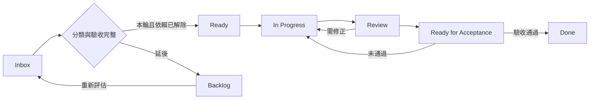

# 專案工作流程：以可交付目標挑選與完成工作

本流程用於新 issue 分類、挑選下一張票、處理 review 衍生工作與里程碑驗收。產品範圍依 [PRODUCT.md](../../PRODUCT.md) 與 [ADR-0041](../adr/0041-scope-is-bounded-by-shippable-features.md)；本文件管理排程與交付證據，不新增產品能力或取代既有契約。

## 1. 先固定本輪目標

目前目標：**一名未接觸 repository 的 Organizer，透過 UI 完成第二場真實活動首次發布；Maintainer 只做必要審核，System 完成發布，Reader 能讀到正確活動。**

目標追蹤面是 [#104](https://github.com/dekkmarsvin/tw_doujin_event/issues/104)，發布實作與驗收集中於 [#212](https://github.com/dekkmarsvin/tw_doujin_event/issues/212)。每次開工先讀最新 issue 與 comments；文件中的票號是路由，不是即時進度。

```powershell
gh issue view 104 --comments
gh issue view 212 --comments
gh issue list --state open --limit 100 --json number,title,labels,assignees
```

**完成範圍差異（2026-09-14 核對）：**分享對話建議首次發布後關閉 #104，但 #104 現有完成目標仍包含至少一次發布後更正。本輪可先完成首次發布里程碑；關閉 #104 前，必須完成其全部驗收，或由維護者明確決定將更正驗收移交 #190 並更新追蹤票。不能僅因本文件把 #190 排在下一階段就關閉 epic。

## 2. 新發現先分類，再決定是否排入

依序回答，將答案寫進 issue 的「目標與排程」段：

1. 對應哪一條 Core User Task？不處理會在哪個真實操作步驟失敗？附輸入、重現方式或缺少的必要能力。
2. 它是否阻止本輪正常流程或既有必要發布 gate？若有可行 UI 路徑，記錄該路徑與代價；僅有優先級或 review 評分不足以證明 blocker。
3. 修正提供使用者能力，還是解除該能力的技術限制？
4. 哪張票已承擔同一完成條件？有重疊時指定一張主票，以 checklist 或 child issue 保留驗收與依賴。

| 工作分類 | 判定 | 排程方式 |
| --- | --- | --- |
| Critical Feature | 本輪正常流程缺少必要的使用者能力 | 加入本輪，寫出受阻步驟與驗收 |
| Critical Architecture | 必要能力因資料模型、發布機制或既有必要 gate 無法完成 | 加入本輪，連到被阻擋的功能與最小解除條件 |
| Next | 有明確正常使用價值，但本輪仍可完成 | 下一階段再選入，記錄重新評估時機 |
| Edge / Hardening | 少見例外、推測性加固，或尚未證明阻擋目標的效能、維護與文件工作 | 留待 triage，記錄觸發條件 |

新 issue 預設不加入 critical path。分類取決於證據，不能僅因標題含 security、architecture、文件或 P1 就決定排程。真實驗收證明會阻擋正常流程，或違反現行必要 gate 時，回到上述四問重新分類；必要檢查失敗不能用「CI 品質」為由跳過。

合併重疊工作時，在主票保留原票連結與驗收條件。被吸收的票只有在承接位置已建立且獲授權時才關閉為 superseded；這不代表功能已完成。

可直接貼入 issue：

```markdown
## 目標與排程
- 目標／主票：
- Core User Task：
- 分類：Critical Feature / Critical Architecture / Next / Edge / Hardening
- 阻擋證據：操作步驟、實際結果、預期結果或缺少的必要能力
- 不處理時的可行路徑與代價：
- 依賴／重複票及承接位置：
- 非目標：
- 驗收：
  - [ ] 可觀察到的完成條件
- 重新評估時機（延後工作填寫）：
```

## 3. 分類與進度分開記錄

沿用 [五個 triage 標籤](../agents/triage-labels.md)：它們描述待評估、待補資料、可交付代理人／人類或不處理。`ready-for-agent` 不代表本輪 blocker；工作分類也不代表已可開工。

先在 issue 內文記錄分類與進度即可。若使用 GitHub Projects，將「工作分類」設為獨立單選欄位；Status 採以下流程：



`Critical Feature` 與 `Critical Architecture` 是並列分類，沒有固定先後。阻塞中的票保留所在進度並寫出 blocker 連結；依賴維護方式依 [issue tracker](../agents/issue-tracker.md)。

## 4. 每次只推進一個可驗收工作

1. **選票**：從本輪 critical path 中選一張規格完整、依賴已解除的票；確認 assignee 與既有 PR，避免重複實作。#222 這類建議提前修的票，仍須記錄選入理由，不自動成為發布 gate。
2. **實作**：依 [domain 查找規則](../agents/domain.md) 讀受影響契約與 ADR，先固定驗收與非目標，再做最小必要變更。完成標準是每項驗收都有實作或明確未完成原因。
3. **驗證與 review**：依 [本機開發與驗證](./local-development.md) 完成適用 gate；UI 變更需在真實瀏覽器操作並留下結果。提交前報告工作樹、diff 摘要與風險。PR 對應主票、契約、驗收證據與範圍邊界。
4. **處理發現**：依 [review-fix loop](../agents/review-loop.md) 判定與修正；自動 review 的觸發保持手動、按風險判斷。範圍外發現回到分類，不自動擴充主票。觸發該文件停止條件時交回維護者。
5. **交付**：實作票按自己的驗收完成；依賴部署或真實活動驗收的票，在相應證據到齊前保持待驗收。合併 PR 不等於本輪目標達成。

GitHub 發文、改票與關票在使用者已授權的範圍內執行；未授權時先準備可貼上的分類與驗收內容。本流程本身不授權發布留言、開啟 production flag 或部署。

## 5. 第二場活動的執行順序

以下為本輪工作路由；開始每階段前核對票的最新內容與狀態。

| 階段 | 主票與子工作 | 離開條件 |
| --- | --- | --- |
| A：真實資料可送審 | #213；#222 為發布前建議修正 | 真實 CSV／XLSX 可匯入，攤位與日期／場館對應正確，地圖、validation、Reader 預覽及送審通過 |
| B：核准後可發布 | #212；#228 recovery 與 #236 dispatch timeout 作為其工程子工作 | 同一核准 snapshot 經 data → main → deployment → Pages production origin smoke 才到 published；失敗能以原 job／snapshot 恢復 |
| C：真實活動驗收 | #212 證據回連 #104 | 完整 UI 流程與至少一次可恢復 publication failure 已驗證，Reader 結果正確，人工技術操作指標達標 |
| D：發布後維護 | #190；再評估 #214、#215、#217、#220 | 依各票驗收；#104 是否可關閉按第 1 節處理 |
| E：後續產品能力 | #134、#163、#161 | 重新檢查產品範圍與依賴後排程，#163 維持依其主票條件等待 #104 |

Phase A、B 依具體依賴安排，不能把路由表當成所有實作必須串行的限制。既有票仍是驗收權威，將 #228／#236 視為子工作不會自動修改或關閉它們。

發布行為依 [ADR-0057](../adr/0057-approval-starts-create-publication.md)，啟用前置依 [ADR-0058](../adr/0058-publication-is-enforced-by-the-app-not-the-ruleset.md) 第 4 節；後者已部分取代 ADR-0046，不能沿用被取代的 ruleset gate，也不能省略仍有效的 App 與檢查邊界。

## 6. 留下完整驗收證據

在 #212 留一份結果，#104 只連到它。實際執行流程：

**建立 → 匯入 → 地圖 → 驗證 → Reader 預覽 → 送審 → 核准並發布 → 自動發布 → production smoke → Reader**。

另驗證一次可恢復失敗：記錄失敗步驟、UI 提示、重試者與結果，證明使用原 job／核准 snapshot、已完成步驟未重建。故障測試須在已授權環境與範圍內執行。

```markdown
## 第二場活動驗收紀錄
- 日期／執行者／環境：
- eventId／candidate revision／approval snapshot：
- publication job／部署與 smoke 證據：
- 各 UI 步驟結果及截圖：
- Reader URL／實際日期、場館、攤位對照結果：
- failure／retry 步驟與原 snapshot 恢復證據：
- 既有活動 Reader 回歸結果：
- 人工技術操作（逐項填數量與原因）：
  - production code 修改：
  - 手動 production JSON／YAML 修改：
  - Git 操作／手動 merge：
  - CLI 操作：
  - 必要 AI agent 操作：
  - 額外人工 publication／deployment 操作：
  - 新增每活動 repository／PAT／secret：
- 未通過項目／承接票：
- 結論：通過／未通過
```

上述人工技術操作以**系統建置完成後，正常新增這一場活動**為統計區間，目標均為 0。必要 UI 輸入、送審與「核准並發布」不算額外人工發布；系統自動 Git／部署不算人工操作。工程開發、一次性環境建置與故障測試操作另列，不混入正常流程，也不可把為了本場成功而做的人工補救排除。任何非零值先記錄原因再分類，不自動升成 P0。

首次發布與可恢復失敗完成後，依 ADR-0058 第 5 節重新評估發布治理；這是後續評估觸發器，不以本流程自動追加新發布 gate。

框架來源：[分享對話：整理專案 Issue 分類](https://chatgpt.com/share/6aa75310-6d9c-83ee-aeab-64946fecd8a6)。對話為規劃依據；票的即時進度與生效 ADR 需另行核對。
