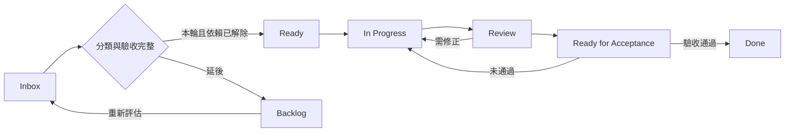

# 專案工作流程：以可交付目標挑選與完成工作

本流程用於新 issue 分類、挑選下一張票、處理 review 衍生工作與里程碑驗收。產品範圍依 [PRODUCT.md](../../PRODUCT.md) 與 [ADR-0041](../adr/0041-scope-is-bounded-by-shippable-features.md)；本文件管理排程、交付證據與成本／複雜度邊界（第 7 節），不新增產品能力或取代既有契約。

## 1. 先固定本輪目標

每輪先確認使用者接受的任務、主 issue、可觀察的完成條件與非目標。產品優先級見 [PRODUCT.md](../../PRODUCT.md#scope)；不要把已完成的里程碑或歷史排程當成下一輪目標。

每次開工讀相關 issue 與最新 comments，再查 open issue／PR；文件中的票號只作證據路由。

```powershell
gh issue view <主票號> --comments
gh issue list --state open --limit 100 --json number,title,labels,assignees
gh pr list --state open
```

關閉里程碑前核對其全部驗收；若由維護者決定接受未完成項或移交後續工作，在原票記錄決定與承接位置，不把未通過項改寫成通過。

## 2. 新發現先分類，再決定是否排入

Review 發現先依 [review-fix loop](../agents/review-loop.md) 決定處置與是否需要開票；需要排程的工作才依序回答以下問題，將答案寫進承接 issue 的「目標與排程」段：

1. 對應哪一條 Core User Task？不處理會在哪個真實操作步驟失敗？附輸入、重現方式或缺少的必要能力。
2. 它是否阻止本輪正常流程或既有必要發布 gate？若有可行 UI 路徑，記錄該路徑與代價；僅有優先級或 review 評分不足以證明 blocker。
3. 修正提供使用者能力，還是解除該能力的技術限制？
4. 哪張票已承擔同一完成條件？有重疊時指定一張主票，以 checklist 或 child issue 保留驗收與依賴。

| 工作分類 | 判定 | 排程方式 |
| --- | --- | --- |
| Critical Feature | 本輪正常流程缺少必要的使用者能力 | 加入本輪，寫出受阻步驟與驗收 |
| Critical Architecture | 必要能力因資料模型、發布機制或既有必要 gate 無法完成 | 加入本輪，連到被阻擋的功能與最小解除條件 |
| Next | 有明確正常使用價值，但本輪仍可完成 | 下一階段再選入，記錄重新評估時機 |
| Edge / Hardening | 少見例外、推測性加固，或尚未證明阻擋目標的效能、維護與文件工作 | 留待 triage，記錄觸發條件 |

新 issue 預設不加入 critical path。分類取決於證據，不能僅因標題含 security、architecture、文件或 P1 就決定排程。真實驗收證明會阻擋正常流程，或違反現行必要 gate 時，回到上述四問重新分類；必要檢查失敗不能用「CI 品質」為由跳過。

合併重疊工作時，在主票保留原票連結與驗收條件。被吸收的票只有在承接位置已建立且獲授權時才關閉為 superseded；這不代表功能已完成。

可直接貼入 issue：

```markdown
## 目標與排程
- 目標／主票：
- Core User Task：
- 分類：Critical Feature / Critical Architecture / Next / Edge / Hardening
- 阻擋證據：操作步驟、實際結果、預期結果或缺少的必要能力
- 不處理時的可行路徑與代價：
- 依賴／重複票及承接位置：
- 非目標：
- 驗收：
  - [ ] 可觀察到的完成條件
- 重新評估時機（延後工作填寫）：
```

## 3. 分類與進度分開記錄

沿用 [五個 triage 標籤](../agents/triage-labels.md)：它們描述待評估、待補資料、可交付代理人／人類或不處理。`ready-for-agent` 不代表本輪 blocker；工作分類也不代表已可開工。

先在 issue 內文記錄分類與進度即可。若使用 GitHub Projects，將「工作分類」設為獨立單選欄位；Status 採以下流程：



`Critical Feature` 與 `Critical Architecture` 是並列分類，沒有固定先後。阻塞中的票保留所在進度並寫出 blocker 連結；依賴維護方式依 [issue tracker](../agents/issue-tracker.md)。

## 4. 每次只推進一個可驗收工作

1. **選票**：從本輪 critical path 中選一張規格完整、依賴已解除的票；確認 assignee 與既有 PR，避免重複實作。建議提前修的票仍須記錄選入理由，不自動成為發布 gate。
2. **實作**：依 [domain 查找規則](../agents/domain.md) 讀受影響契約與 ADR，先固定驗收與非目標，再做最小必要變更。完成標準是每項驗收都有實作或明確未完成原因。
3. **驗證與 review**：依 [review-fix loop](../agents/review-loop.md) 決定 reviewer 編成與相稱驗證，[本機開發與驗證](./local-development.md) 提供適用 gate 的執行方式。提交前報告工作樹、diff 摘要與風險。PR 對應主票、契約、驗收證據與範圍邊界。
4. **處理發現**：finding 處置、聚焦 verification、review Done 與熔斷均依 [review-fix loop](../agents/review-loop.md)，不在本文件另設 review 輪次或編成。
5. **交付**：實作票按自己的驗收完成；依賴部署或真實活動驗收的票，在相應證據到齊前保持待驗收。合併 PR 不等於本輪目標達成。

GitHub 發文、改票與關票在使用者已授權的範圍內執行；未授權時先準備可貼上的分類與驗收內容。本流程本身不授權發布留言、開啟 production flag 或部署。

## 5. 進度與驗收紀錄放在哪裡

實作順序、依賴與結案原因以主 issue／PR 的最新內容為準，不在 runbook 維護第二份佇列或逐票 changelog。票仍缺決策或驗收條件時，先補齊再開工；等待時可移往前置已滿足的工作。新的正常流程 blocker 需記錄受阻步驟，其他發現依 review-fix loop 處置。

下一場活動若要驗收零人工補救，沿用第 6 節；不把已結案票重新當成目前目標。發布設定與操作依[部署 runbook](./deployment.md)，fake driver 的 published 只證明測試接線，不能代替真實公開結果。

## 6. 留下完整驗收證據

驗收結果與證據集中在本輪主票或對應 PR，其他票只連到那則留言；repo 不新增日期化的驗收、驗證或視覺檢查文件。

需要附圖時，截圖提交在 PR 分支的 `.evidence/<主題>/`，以該 commit 的 `https://raw.githubusercontent.com/dekkmarsvin/tw_doujin_event/<commit SHA>/.evidence/…` 嵌入 PR 本文或主票留言；合併前最後一個 commit 刪除 `.evidence/`，main 不保存證據圖。含證據的 commit 之後不再改寫或 force-push，否則固定連結會失效。含登入帳號、email 或其他個人資料的畫面不上傳。

新增截圖與移除截圖的兩個 commit 在本機備妥後同批 push，保留固定 commit 連結但避免為搬圖再觸發一輪 CI。受測內容／環境未變時沿用既有有效證據，註明對應版本；不為更新 PR 文字重拍相同畫面。Actions 的七天 artifact 用於診斷，不能取代 issue／PR 上持續可查的驗收紀錄；本階段沿用此保存方式，不新增儲存服務。

主辦活動發布的完整流程：

**建立 → 匯入 → 地圖 → 驗證 → Reader 預覽 → 送審 → 核准並發布 → 自動發布 → production smoke → Reader**。

另驗證一次可恢復失敗：記錄失敗步驟、UI 提示、重試者與結果，證明使用原 job／核准 snapshot、已完成步驟未重建。故障測試須在已授權環境與範圍內執行。

```markdown
## 活動發布驗收紀錄
- 日期／執行者／環境：
- eventId／candidate revision／approval snapshot：
- publication job／部署與 smoke 證據：
- 各 UI 步驟結果及截圖：
- Reader URL／實際日期、場館、攤位對照結果：
- failure／retry 步驟與原 snapshot 恢復證據：
- 既有活動 Reader 回歸結果：
- 人工技術操作（逐項填數量與原因）：
  - production code 修改：
  - 手動 production JSON／YAML 修改：
  - Git 操作／手動 merge：
  - CLI 操作：
  - 必要 AI agent 操作：
  - 額外人工 publication／deployment 操作：
  - 新增每活動 repository／PAT／secret：
- 未通過項目／承接票：
- 結論：通過／未通過
```

上述人工技術操作以**系統建置完成後，正常新增這一場活動**為統計區間，目標均為 0。必要 UI 輸入、送審與「核准並發布」不算額外人工發布；系統自動 Git／部署不算人工操作。工程開發、一次性環境建置與故障測試操作另列，不混入正常流程，也不可把為了本場成功而做的人工補救排除。任何非零值先記錄原因再分類，不自動升成 P0。

發布治理的邊界見 [ADR-0066](../adr/0066-the-ruleset-cannot-bound-an-app-that-writes-checks.md)；本流程不另加發布 gate。

## 7. 成本與複雜度執行目標

在不改變既有公開靜態閱讀、身分驗證、活動隔離、核准快照、發布恢復與資料保留規則的前提下，建立 Cloudflare 成本基準，阻止沒有必要性的計費操作與服務擴張。

方案基準與既有 ADR 的成本前提落差見 [ADR-0065](../adr/0065-cost-reasoning-uses-the-workers-paid-basis.md)。本節不是「重新設計低成本架構」，也不另建成本監控產品。R2 的每日量測已有 [Cloudflare 容量與耗用監控](./cloudflare-usage-monitoring.md)，延伸它可以，另起一套不行。

### 7.1 訂閱與計費基準（查核日 2026-09-19）

來源為 Dashboard 的「計費 → 訂閱」與「計費 → 計費用量」兩頁。帳號識別碼不寫入版控，見 [Cloudflare 容量與耗用監控](./cloudflare-usage-monitoring.md)的設定規則。

**訂閱狀態**：`Workers Paid`（使用中，續訂 Sep 22, 2026）、`R2 Paid`（使用中，同續訂日）、`Zero Trust Teams Free Base`、`kotoban.top Free Plan`。

> 方案層級的判定來源與 Free／Paid 限制對照見 [ADR-0065](../adr/0065-cost-reasoning-uses-the-workers-paid-basis.md)。

**計費用量**（計費期間 Aug 22 – Sep 21, 2026，已觀察 29 天／共 31 天）：總成本 `$0.00`，預估週期成本 `$0.00`，每日平均 `$0.00`。Dashboard 明示「所有使用量皆在包含的層級限制內」。

| 計費項目 | 使用量總計 | 內含額度 | 計費用量 | 占內含 |
|---|---|---|---|---|
| Workers Standard Requests | 5.52k | 10M／月 | 0 | 0.06% |
| Workers CPU ms | 37.59k | 30M／月 | 0 | 0.13% |
| D1 Rows Read | 145.09k | 25B／月 | 0 | ~0% |
| D1 Rows Written | 3.69k | 50M／月 | 0 | 0.007% |
| D1 Storage GB-mo | 0 | 5 GB | 0 | 0% |
| R2 Class A Operations | 1.09k | 1M／月 | 0 | 0.11% |
| R2 Class B Operations | 2.55k | 10M／月 | 0 | 0.03% |
| R2 Data Storage | 0 GB-mo | 10 GB-mo | 0 | 0% |

**既有預算警示**：帳號層級三個，門檻 `$1.00`／`$10.00`／`$20.00`，各 1 位收件人，Sep 2026 皆 0%。

**建議預算目標**：一般月份 US$5–10、活動高峰月份 US$20 以內，預估超過 US$30 時維護者介入。這些是管理目標，不是 Cloudflare 的自動停費上限。幣別為美元、未含稅及外部供應商（例如 Mailgun）費用。基本費與內含額度按帳號計算；有其他專案共用此帳號時記錄共用用量，不得每個環境重複扣除一份額度。**目前尚無 `$30` 警示，若採用此目標需另行建立。**

### 7.2 資源清單與證據等級

| 項目 | 內容 | 證據等級 |
|---|---|---|
| Pages | `tw-catalog`：靜態閱讀與 Pages Functions，Direct Upload（無 Git 連線） | 已測量 |
| 已部署 Worker | `tw-catalog-publication-dispatch`、`tw-catalog-publication-dispatch-preview`、`tw-catalog-retention-purge`、`tw-catalog-retention-purge-preview` | 已測量（API，2026-09-25） |
| preview 通知 Worker | `tw-catalog-publication-dispatch-preview` 於 2026-09-23 由 [PR #349](https://github.com/dekkmarsvin/tw_doujin_event/pull/349) 記錄的授權 Direct Upload 建立，綁 preview D1、publication 停用；觀測設定與 production 相同，7.3 第 6 點的 events 估算未含它 | 已測量（API）／設定檔 |
| 排程角色 | publication-dispatch 每分鐘、retention-purge 每日 `17 3 * * *`，兩者 production／preview 各一 | 設定檔 |
| D1 | production `3,014,656` bytes、preview `532,480` bytes | 已測量（API） |
| R2 | thumbnails、map-contributions，production／preview 各一，共 4 個 bucket | 已測量（API） |
| 觀測 | 兩個獨立 Worker 的 Logs 與 Traces 均為全量取樣（`head_sampling_rate: 1`） | 設定檔 |
| 閱讀端 | reviewed base 為靜態資料；`overrides.json` 是既有動態例外 | 程式 |
| 公開 overlay client | `app/use-circle-catalog.ts` 為每活動單次載入，**未見固定輪詢** | 程式 |
| 初始化 | Pages 與 publication Worker 均已有依 D1 binding 共用的 repository，不是每次呼叫重建 | 程式 |
| 圖片 | 公開縮圖走 R2 custom domain，不經 Function | 程式／ADR-0017 |

**已知落差，標記為未取得，不得以任一方冒充另一方：** D1 Dashboard 指標頁（分析資料集）顯示近 7 天讀取列 647k，計費用量頁（計費資料集）顯示近 29 天 D1 Rows Read 僅 145.09k。兩者口徑不同且方向矛盾，尚未釐清。**計費以計費用量頁為準**；指標頁只用於觀察趨勢與相對變化，不得拿來推算費用。

### 7.3 計費解讀的必要邊界

1. `Cache-Control: max-age=60` 不代表瀏覽器每 60 秒自動請求。請求頻率與尚未達成的更新可見性要求統一見[資料傳輸契約](../contracts/delivery-and-offline.md#更新可見性)，成本估算不得套用舊有 Free 額度與每分鐘輪詢假設。
2. 現有 overlay 回 304 仍經過 Function 與 D1，ETag 不會免除這些操作。
3. CPU time 不等於請求經過時間。等待 GitHub、D1 或其他網路回應不計入 CPU——這是 ADR-0022 已述的規則，也是 PR #285 前 7.6 秒的 tick 不曾觸發 CPU 限制的原因。
4. D1 按實際掃描／寫入的列數計費，不是 SQL 次數或回傳列數。DELETE 與索引更新也會增加寫入用量。查詢次數的大幅變化不等於費用的變化。
5. R2 免網路流出費不等於所有操作免費：LIST 屬 Class A，GET／HEAD 屬 Class B，DELETE 本身免費但列舉及相關 D1 更新仍需盤點。Standard 的免費額度不能套用到 Infrequent Access，估算須考慮計費單位進位。
6. Workers Traces 目前為 beta 免費。**自 2026-10-01 起，每個 span 算一個 observability event，與 Workers Logs 共用同一份額度**：Workers Paid 每月內含 2,000 萬 events、超出 $0.60／百萬、保留 7 天。不是一個 trace 算一個 event，也不是 Logs 與 Traces 各有一份完整額度。依 PR #285 後每 tick 約 3 spans 估算，dispatch Worker 約 175k events／月（內含額度的 0.9%），目前不需調整取樣；tick 頻率或 span 數上升時重算。
7. 根目錄 Pages 設定檔不支援 `observability`，見[部署 runbook](./deployment.md#organizer-發布)。
8. 預算提醒及單次 CPU 限制不等於帳號總費用硬上限。先確認現有方案與部署類型支援什麼，不為了預算管理先升級產品。

### 7.4 複雜度預算

| 邊界 | 預設要求 |
|---|---|
| 新增 Cloudflare 產品或常駐／排程角色 | 0；確有必要時先提出維護者決策，不自行引入 |
| 每新增一場正常活動所需人工基礎設施設定 | 0；不新增專屬 Worker、DB、bucket、repo 或 token |
| 公開基礎場刊與地圖 | 保持靜態，不為 SSR、追蹤或統一 middleware 改走 Function |
| 新增每次閱讀的持久化寫入 | 0；不在閱讀路徑附帶 last_seen、稽核、修復或備份寫入 |
| 發布執行機制 | 沿用既有 dispatcher、checkpoint、lease、retry 與 webhook／cron 恢復，不疊第二套 |
| 觀測方式 | 先用平台既有能力，不新增 metrics DB、log forwarding Worker 或自製帳務服務 |
| 工作範圍 | 一個可驗收的成本基準／局部修正任務；不建立跨專案重構計畫 |

這些預設不是取消安全或資料正確性需求的理由。授權、HMAC、秘密管理、活動隔離、snapshot/hash/pin、發布冪等與恢復、必要 CI 及資料清除規則維持有效。

### 7.5 執行順序

**A. 先建立現況與差額。** 交付資源／用量／費用表，清楚區分已測量、依程式推算、未知（見 7.1、7.2）。已知正常流量、活動尖峰與 preview 測試用量不要混為單一假設。缺資料標示「未取得」，不得用假設用量冒充監測結果，也不得因此啟動一套自製 telemetry pipeline。沒有 30 天資料不必等 30 天才交付現有功能；用已知樣本與明確假設說明估算限制。

**B. 只處理有證據的問題。** 可在既有架構內局部修正重複請求、不必要的逐次寫入、過量輸出、已有保留規則未執行或明確的路由／快取設定錯誤。任何修改都須指出受影響的使用者操作與前後差異。

文件中「每分鐘 revalidate」與現行單次載入的落差先如實記錄；若已接受的撤下／更新可見性要求需要變更行為，提出最小方案及請求成本，不自行刪除要求，也不默默新增輪詢。

不為省極小成本重寫排程、關掉必要 preview 清除、取消 production／preview 隔離，或遷移儲存產品。

**C. 依既有規則驗證並結束。** 沿用適用測試、required CI 與受影響流程的有限 preview smoke。純文件改動依[純文件檢查](./local-development.md#純文件變更)，不額外要求全面端到端測試。不對 production 刻意耗盡配額（ADR-0031 已定案），不以新增大量測試證明推測性災難。review 的人員、輪次、finding 處置及熔斷只依 [review-fix loop](../agents/review-loop.md)，不另訂平行稽核流程。

### 7.6 擴充門檻

新機制提案至少說明：現行方案在哪個真實操作或可信失敗路徑不足、每次操作增加／減少哪些計費量、預估每月淨費用差、增加哪些維護責任、為何既有機制不能局部解決。

**經濟門檻：純省錢且需要新增服務／架構的提案，預估每月淨節省不到 US$5 時不採用**；局部刪除重複操作不受此門檻限制。即使預估節省超過門檻，仍須比較維護代價並取得必要授權。此門檻不適用於必要的安全、資料完整性或使用者流程修正。

只有「最佳實務」「以後可能有流量」「多一層更安全／完整」而無具體依據的提案，依既有 review-loop 處置，不自動建立 follow-up issue。

### 7.7 成本工作的完成條件

- 資源清單、計費項目與已知／未知用量已明確。
- 預算目標已由維護者接受，或明確保留為待決策提案。
- 每個採納修正都有實際問題、最小變更與相稱驗證。
- 未新增未核准的 Cloudflare 產品、排程角色、持久化層或人工設定步驟。
- 既有安全、發布恢復、靜態閱讀與資料保留邊界沒有退化。
- 非阻擋、推測性的擴充不再延伸本輪工作；依既有 review Done 條件結束。

### 7.8 PR 成本影響欄位

第 4 節「交付」時一併填寫。沒有成本影響的純 UI／文案變更填「無」即可，不要求為每個 PR 完整量測整個系統。

```text
成本影響：無 / 降低 / 增加 / 尚待量測
新增產品或排程角色：0（例外須寫核准依據）
受影響的使用者操作：
每次操作的 Worker / D1 / R2 / 觀測事件差額：
月用量假設、資料期間、預估費用差：
新增維護責任及替代／刪除的既有機制：
驗證結果與剩餘未知：
```

計費表保留查核日期；**官方價格才是費率來源**，本節數字是查核日的快照，不是持續有效的費率承諾。查核來源：Workers、Pages Functions、D1、R2 pricing 與 Workers traces／limits 官方文件（查核日 2026-09-19）。

框架來源：[分享對話：整理專案 Issue 分類](https://chatgpt.com/share/6aa75310-6d9c-83ee-aeab-64946fecd8a6)。對話為規劃依據；票的即時進度與生效 ADR 需另行核對。
