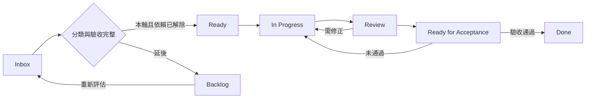

# 專案工作流程：以可交付目標挑選與完成工作

本流程用於新 issue 分類、挑選下一張票、處理 review 衍生工作與里程碑驗收。產品範圍依 [PRODUCT.md](../../PRODUCT.md) 與 [ADR-0041](../adr/0041-scope-is-bounded-by-shippable-features.md)；本文件管理排程、交付證據與成本／複雜度邊界（第 7 節），不新增產品能力或取代既有契約。

## 1. 先固定本輪目標

目前目標：**一名未接觸 repository 的 Organizer，透過 UI 完成第二場真實活動首次發布；Maintainer 只做必要審核，System 完成發布，Reader 能讀到正確活動。**

目標追蹤面是 [#104](https://github.com/dekkmarsvin/tw_doujin_event/issues/104)，發布實作與驗收集中於 [#212](https://github.com/dekkmarsvin/tw_doujin_event/issues/212)。每次開工先讀最新 issue 與 comments；文件中的票號是路由，不是即時進度。

```powershell
gh issue view 104 --comments
gh issue view 212 --comments
gh issue list --state open --limit 100 --json number,title,labels,assignees
```

**完成範圍差異（2026-09-14 核對）：**分享對話建議首次發布後關閉 #104，但 #104 現有完成目標仍包含至少一次發布後更正。本輪可先完成首次發布里程碑；關閉 #104 前，必須完成其全部驗收，或由維護者明確決定將更正驗收移交 #190 並更新追蹤票。不能僅因本文件把 #190 排在下一階段就關閉 epic。

## 2. 新發現先分類，再決定是否排入

Review 發現先依 [review-fix loop](../agents/review-loop.md) 決定處置與是否需要開票；需要排程的工作才依序回答以下問題，將答案寫進承接 issue 的「目標與排程」段：

1. 對應哪一條 Core User Task？不處理會在哪個真實操作步驟失敗？附輸入、重現方式或缺少的必要能力。
2. 它是否阻止本輪正常流程或既有必要發布 gate？若有可行 UI 路徑，記錄該路徑與代價；僅有優先級或 review 評分不足以證明 blocker。
3. 修正提供使用者能力，還是解除該能力的技術限制？
4. 哪張票已承擔同一完成條件？有重疊時指定一張主票，以 checklist 或 child issue 保留驗收與依賴。

| 工作分類 | 判定 | 排程方式 |
| --- | --- | --- |
| Critical Feature | 本輪正常流程缺少必要的使用者能力 | 加入本輪，寫出受阻步驟與驗收 |
| Critical Architecture | 必要能力因資料模型、發布機制或既有必要 gate 無法完成 | 加入本輪，連到被阻擋的功能與最小解除條件 |
| Next | 有明確正常使用價值，但本輪仍可完成 | 下一階段再選入，記錄重新評估時機 |
| Edge / Hardening | 少見例外、推測性加固，或尚未證明阻擋目標的效能、維護與文件工作 | 留待 triage，記錄觸發條件 |

新 issue 預設不加入 critical path。分類取決於證據，不能僅因標題含 security、architecture、文件或 P1 就決定排程。真實驗收證明會阻擋正常流程，或違反現行必要 gate 時，回到上述四問重新分類；必要檢查失敗不能用「CI 品質」為由跳過。

合併重疊工作時，在主票保留原票連結與驗收條件。被吸收的票只有在承接位置已建立且獲授權時才關閉為 superseded；這不代表功能已完成。

可直接貼入 issue：

```markdown
## 目標與排程
- 目標／主票：
- Core User Task：
- 分類：Critical Feature / Critical Architecture / Next / Edge / Hardening
- 阻擋證據：操作步驟、實際結果、預期結果或缺少的必要能力
- 不處理時的可行路徑與代價：
- 依賴／重複票及承接位置：
- 非目標：
- 驗收：
  - [ ] 可觀察到的完成條件
- 重新評估時機（延後工作填寫）：
```

## 3. 分類與進度分開記錄

沿用 [五個 triage 標籤](../agents/triage-labels.md)：它們描述待評估、待補資料、可交付代理人／人類或不處理。`ready-for-agent` 不代表本輪 blocker；工作分類也不代表已可開工。

先在 issue 內文記錄分類與進度即可。若使用 GitHub Projects，將「工作分類」設為獨立單選欄位；Status 採以下流程：



`Critical Feature` 與 `Critical Architecture` 是並列分類，沒有固定先後。阻塞中的票保留所在進度並寫出 blocker 連結；依賴維護方式依 [issue tracker](../agents/issue-tracker.md)。

## 4. 每次只推進一個可驗收工作

1. **選票**：從本輪 critical path 中選一張規格完整、依賴已解除的票；確認 assignee 與既有 PR，避免重複實作。#222 這類建議提前修的票，仍須記錄選入理由，不自動成為發布 gate。
2. **實作**：依 [domain 查找規則](../agents/domain.md) 讀受影響契約與 ADR，先固定驗收與非目標，再做最小必要變更。完成標準是每項驗收都有實作或明確未完成原因。
3. **驗證與 review**：依 [review-fix loop](../agents/review-loop.md) 決定 reviewer 編成與相稱驗證，[本機開發與驗證](./local-development.md) 提供適用 gate 的執行方式。提交前報告工作樹、diff 摘要與風險。PR 對應主票、契約、驗收證據與範圍邊界。
4. **處理發現**：finding 處置、聚焦 verification、review Done 與熔斷均依 [review-fix loop](../agents/review-loop.md)，不在本文件另設 review 輪次或編成。
5. **交付**：實作票按自己的驗收完成；依賴部署或真實活動驗收的票，在相應證據到齊前保持待驗收。合併 PR 不等於本輪目標達成。

GitHub 發文、改票與關票在使用者已授權的範圍內執行；未授權時先準備可貼上的分類與驗收內容。本流程本身不授權發布留言、開啟 production flag 或部署。

## 5. 實作佇列

### 排程基準與下一步

2026-09-20 核對 GitHub open issues（26 張）與 main `2dd91e7`。目前沒有 open PR。以下是**尚待執行的順序**，不是完成紀錄。每次開工核對新 PR／issue 決策，跳過已有完成證據的工作。

**第二場活動的首次發布佇列已完成。** 原表 13 列中 #213、#241、#243、#244、#245、#246、#237、#235、#236、#190 均已關閉；CH20 首次發布（`docs/design/ch20-first-publication-acceptance.md`）與 #190 的地圖更正（`docs/design/ch20-map-correction-acceptance.md`）都留下驗收紀錄，`data/published-events.json` 現有 `ff47` 與 `ch-20`。#227（甲）的 `Browser acceptance` 已在 `app/publication-rollout.ts` 的 `PUBLICATION_REQUIRED_CHECKS.main` 內，該票剩餘範圍只有（乙）。

**這不改寫 #212／#104 既有的非零人工技術操作指標**，#277 的工程補救與兩次 UI retry 仍照第 6 節記為非零；兩張票維持 OPEN，結案判定見第 0 梯。

**下一張實作票是發布治理重新評估（#232、#227乙、#234）。** 它是一次決策而非直接實作，ADR-0058 §5 的觸發條件在 CH20 首次發布與一次可恢復失敗完成時就已成立，至今又過了 #190 更正與 `pf45-rf14` 兩場。

第 0 梯的四項判定已於 2026-09-20 執行：#242、#228、#279 驗收後結案；#104／#212 驗收不通過，先決定以零補救重測取代結案，PF45 發布後改為由維護者直接結案，未達成項不改寫（見下節）。

2026-09-20 已完成並移出本表：**#286**（A／B／C 由 PR #289、D 由 PR #295 交付）與 **#240／#239／#233**（PR #296）。同日另有 **#292／#293** 的讀者展區切換與 **#291** 的主辦儲存回饋，兩者不在本表，依 review-loop 直接交付。

按目前單人維護方式，一次推進一張實作 PR；下表的數字是預設執行順序，「必要前置」才是技術依賴。遇到決策或外部設定等待，可移往前置已滿足的票，不必空等。

「需視覺確認」欄依 [review-fix loop](../agents/review-loop.md)〈UI 的任務式瀏覽器操作與視覺驗收維持適用要求〉標示該票的驗收形式，不是新的 gate：

- **實機操作**：互動、幾何、命中或座標，截圖不足以判定，必須在瀏覽器走真實操作路徑。
- **視覺確認**：版面、文案落點或停用態，截圖或單點檢查即可。
- **不需要**：程式、契約、文件或純決策。

### 第 0 梯：前提失效的判定（2026-09-20 已執行）

原佇列有四張票的前提隨首次發布完成而失效，逐項核對於 main `5860b5f`：

| 票 | 驗收結果 | 處置 |
| --- | --- | --- |
| **#242** | 四項驗收中前三項通過：UI〈退回修改〉面板、`reopenFailedOrganizerCandidate()` 與 `organizer_event.reopened` audit、遠端紀錄存在時拒絕退回；覆蓋 `tests/browser/portal-organizer-reopen.mjs` 與兩支 module 測試。第四項「`ch-20` 實際完成退回」**不適用**——CH20 已走首次發布完成，該待救援狀態不存在。 | **已結案。** 退回能力目前只有工程與 browser journey 證據，沒有真實活動使用紀錄；要補真實退回驗收須另行指定活動與情境開票。 |
| **#228** | 三項待決事項均有落地答案：durable dispatch 自動重入（`workers/publication-dispatch` cron `* * * * *` + lease 撿取 queued）、15 分鐘逾時轉 `failed`／`queued_timeout`、CH20 該筆由 cron 於 2026-09-15 自然撿走而未做一次性資料修正。 | **已結案。** |
| **#279** | 23 項驗收由 PR #281／#282／#283 三個切片交付，逐項證據見 `docs/design/map-authoring-279-acceptance.md`，#282 的 required CI 全套通過。 | **已結案。** 結案時已知三項回歸（A 四角縮放跳動、B 舊外框殘留、C 描摹失去中央命中）未修，承接位置是 #286；關閉本票不代表這三項已修。 |
| **#104／#212** | **不通過。** #104 的 45 項中 44 項已勾，未勾的是「完整建立至發布流程沒有 production code diff、Organizer Git／CLI 操作或 AI agent 依賴」；#212 的 55 項中 5 項未勾，全是第 6 節的人工技術操作指標（production code diff、手動 merge、CLI、AI agent、手動 deployment 各為 0）。實測為非零，逐項數字見 `docs/design/ch20-first-publication-acceptance.md`〈人工操作與完成邊界〉。 | **已結案（2026-09-20，維護者決定）。** 先決定以重測取代直接結案，PF45 發布後改為直接結案。未達成項不改寫、未勾選的項目維持未勾選，見下節。 |

### 零補救重測：未執行，#104／#212 改為直接結案

維護者於 2026-09-20 先決定以一次零補救的完整旅程重測取代直接結案，對象為 PF45（花博爭豔館）。當天 `pf45-rf14` 確實發布（main `ad0c283`，approval snapshot `d1b38b92…`，bot PR #290），`data/published-events.json` 因此有 `ff47`、`ch-20`、`pf45-rf14` 三場。

**但那趟旅程的七項人工技術操作指標沒有記錄下來。** 所以 #104 的一項與 #212 的五項既不是通過，也不是重新量測後仍未通過——是沒有量。維護者據此決定直接結案，兩票已關閉；未勾選的項目維持未勾選，CH20 的實測值保留在 `docs/design/ch20-first-publication-acceptance.md`〈人工操作與完成邊界〉，不因結案改寫。

**下一場活動若要量這組指標**，第 6 節的統計區間、規則與紀錄格式仍然適用：區間是「系統建置完成後，正常新增這一場活動」；必要 UI 輸入、送審與「核准並發布」不算額外人工發布；旅程中途若必須修 production code、手動 merge、跑 CLI、動用 AI agent 或手動部署，當場記錄原因，不把修正併入統計後宣稱通過。

上次非零的成因已經消失：PR #265（driver 斷言清掉既有 events）與 #266（dispatch 不相容 workerd）造成的 production code 修改、人工 merge、CLI 寫入與人工部署，三者連同 amendment 路徑的 #277 都已在 main。

**這趟旅程留下兩個仍然開啟的發現**，與指標無關但源自同一場活動：[#294](https://github.com/dekkmarsvin/tw_doujin_event/issues/294)（1434 列匯入把攤位排號字首當成展區，活動定義因此有 13 個名不副實的展區；含 `pf45-rf14` 是否以 amendment 修正的待決項）與 [#298](https://github.com/dekkmarsvin/tw_doujin_event/issues/298)（場館／使用空間／展區三層在建立活動時沒有可依據的說明，是 #294 的成因）。

### 實作佇列

| 順序 | 工作／歸屬 | 必要前置 | 需視覺確認 | 本次交付與離開條件 |
| --- | --- | --- | --- | --- |
| 1 | **發布治理重新評估：#232、#227（乙）、#234** | ADR-0058 §5 的觸發條件已成立 | **視覺確認**（僅 #234 文案落點） | 先做一次決策再實作，三者共用同一份決策，不分三次排。ADR-0058 §5 要求前提改變時重新評估是否把 ruleset 恢復為第二道強制邊界，並一併解決「一般人類 PR 如何滿足 `Organizer publication approval`」。#232 補上 PR 作者的本 App 身分綁定（ADR-0058 決策 1 記錄的已知缺口）；#227（乙）決定哪些 `actor_type` 進 `problems`、用同一或分開的 code、以及是否為硬性啟用前置；#234 決定 gate 關閉時失敗文案與停用重試鍵不再各說各話。 |
| 2 | **#224：organizer-app.tsx 拆檔** | 無 | **視覺確認**（重構回歸） | 拆 1660 行單檔與 `ReviewPanel` 的五件事。共用的 `act()` 與 `owner &&` 渲染判斷是第 5、6 步的直接障礙，先拆才做得下去；票標 P3，但位置在依賴鏈的頭。只搬移與拆分，不順帶改文案或行為。 |
| 3 | **#220：回饋落點與清除時機** | #224 | **實機操作** | 每個動作的結果回到發動它的控制項旁，通知隨動作與區段切換清除；不再出現「已儲存。」與「尚有未儲存變更」同框，或按下「建立預覽」成功後頂端仍停在兩步之前的訊息。落點需實際量測，不以截圖目測代替。 |
| 4 | **#217：條件未滿足的動作改停用＋原因** | #224 | **視覺確認** | 在 `docs/design/components.md` 增加這條並與既有 Locked Fields 並列、說明兩者差別；盤點主辦工作區目前以「不渲染」處理條件的控制項並逐一改為停用＋原因，已知至少有 `ReviewPanel` 的送審、協作者與負責人三塊。面板共用的缺失條件依回饋規則在面板頂端講一次。 |
| 5 | **#222：場館必須明確選擇** | 無，可在等待 review 時插入 | **實機操作** | 「請選擇場館」成為真正的預設值，新增使用空間時不預選任何場館與空間。**原表「降低重建 CH20 地圖風險」的選入理由已失效**，改以「場館空間決定地圖張數、匯入能否落地與公開網址形狀，而錯誤選擇是合法值、驗證抓不到」為理由；仍屬 SHOULD，不新增硬性發布 gate。需實際操作「新增使用空間」驗證。 |
| 6 | **#218／#219：地圖與場館表單的兩個落差** | 無 | **視覺確認** | #218 擋下零攤位地圖的建立，不讓空白地圖推進一個版本並在歷史留下空紀錄，同時檢討「1 張地圖」這個計數；#219 讓空間來源網址可繼承場館網址，並把兩個網址欄位的必填錯誤從瀏覽器原生泡泡改為全站一致的行內錯誤、統一命名。 |
| 7 | **#223 → #225：工作區文案收斂** | #223 的決策先於 #225 | **視覺確認** | #223 先決定 `map-contribution-draft` 的問題文案是共用或分流——它同時服務主辦工作區與地圖貢獻兩個控制面，`period` 這類實作術語才會有單一修法；#225 再依 `docs/design/copy.md` 的 Removal Test 收斂內部詞彙（`ALL`）、自相矛盾的狀態（「不會上傳」與「尚未上傳」同框）與冗餘徽章。 |
| 8 | **#221：主辦工作區 UX 整體收斂** | 第 2–7 步 | **實機操作** | 範圍最大的一張：移除頂部六步驟列、引導期不顯示 `ReadinessRail`、修正完成計數、收斂資料結構語言與 CSV 範例入口。前面幾項落地後再做，避免重工。不重做 organizer 架構，不新增第二套 Wizard／進度元件。 |
| 9 | **#294 → #298：展區的填寫依據** | #294 的 `pf45-rf14` 修正與否需維運者決定；#298 的形式待定 | **視覺確認** | #294 讓匯入預覽偵測「每一列的展區值都等於攤位代碼第一個字」並提醒，且讓「無分區」在沒有合適來源欄時直接可選；#298 補上場館／使用空間／展區三層在做選擇當下的說明，形式（示意圖、真實活動舉例或互動 demo）先定案再實作。兩者互補：#298 讓人一開始就填對，#294 在填錯時擋住。 |
| 10 | **#214 → #215：攤位清單編輯器（二）（三）** | #213 已關閉，blocked-by 解除；#215 與 #286 同改 `map-layout-editor.tsx`，不並行 | **實機操作** | #214 讓攤位清單本身成為可維護對象：群組拆分、合併與逐列編輯，整份清單以 `expectedVersion` PUT 回去，維持「匯入是取代語意」不做逐列 API；#215 讓 `MapLayoutEditor` 接收 authoring scope，清單與地圖雙向對照，主辦在畫地圖當下就知道還差哪些攤位。 |

### 下一輪產品排程（尚未選入）

首次發布已完成，第 1 節的本輪目標達成後，再依實際使用回饋決定這一批的順序，不預先排定：

| 票 | 需視覺確認 | 選入時要先確認的事 |
| --- | --- | --- |
| **#204** 桌機閱讀端三項視覺問題 | **實機操作** | 761px 下地圖僅剩 25%、詳情面板 8px 未達 AA、浮動工具壓住攤位。票內已寫三項可各自獨立處理；需先定「選取後至少要看得到多少地圖」的驗收值，量測以多視窗寬度的實際 DOM 為準。 |
| **#193** 分級與特殊題材 taxonomy | 視覺確認 | 資料層已可表達多值分級，缺的是受控 taxonomy 與 Reader 的二元 R18 模型。 |
| **#134** 多活動入口分組 | 視覺確認 | `published-events.json` 現有兩場，觸發條件比 2026-09-07 盤點時接近，但仍未達票內自訂的「扁平列表難以使用」。動工前先驗證既有日期精度是否足夠，不捏造時分秒。 |
| **#161** 維運控制面拆分為 `/admin` | **實機操作** | 只搬移既有管理功能；需驗證 admin 資產不進 Reader precache。 |
| **#163** 公開活動入口與自助登記 | **實機操作** | blocked by #104，隨第 0 梯的 #104 判定一併解除或維持。 |
| **#189** 收斂 audit | 不需要 | 交付可審閱的簡化方案與 ADR 草案，不直接刪除正式資料。 |
| **#205** 測試組合收斂 | 視覺確認 | #286 已在沿用其原則（擴充既有 browser journey、不新增 source-regex 測試）。整批重構安排在 UX 梯次之後，避免與進行中的 UI 改動互相推翻。 |

**#144**（domainMatch 依 provider 限定自動認領，不需視覺確認）規格完整、範圍小且已標 `ready-for-agent`，可在任一梯次等待 review 時插入，不需要為它重新排序。

### 首次發布的執行紀錄

第二場活動的部署、CH20 修正、啟用與驗收已執行完畢，操作順序與結果不再列為待辦。證據入口：#212 的驗收留言、`docs/design/ch20-first-publication-acceptance.md`、`docs/design/ch20-map-correction-acceptance.md`（#280）。

其中兩條規則對之後的活動仍然適用：`ORGANIZER_PUBLICATION_MODE` 留在版本控制的設定與部署驗證裡，不在 dashboard 臨時切換（`wrangler.jsonc` 的部署會覆寫 dashboard vars）；fake driver 回報的 published 只能證明接線，不能代替真實 deployment、無人推進與公開結果三者各自的完成證據。

### 重排條件

票仍標 `needs-triage` 時，先補齊該票的決策與驗收才開工。若真實驗收冒出新的正常流程 blocker，記錄它替換／阻擋哪一個步驟並重新排序；其他發現依 [review-fix loop](../agents/review-loop.md) 處置。此表不自動修改 GitHub 標籤、依賴或關閉子票，第 0 梯的四項判定也需維護者明確決定後才執行。

## 6. 留下完整驗收證據

在 #212 留一份結果，#104 只連到它。實際執行流程：

**建立 → 匯入 → 地圖 → 驗證 → Reader 預覽 → 送審 → 核准並發布 → 自動發布 → production smoke → Reader**。

另驗證一次可恢復失敗：記錄失敗步驟、UI 提示、重試者與結果，證明使用原 job／核准 snapshot、已完成步驟未重建。故障測試須在已授權環境與範圍內執行。

```markdown
## 第二場活動驗收紀錄
- 日期／執行者／環境：
- eventId／candidate revision／approval snapshot：
- publication job／部署與 smoke 證據：
- 各 UI 步驟結果及截圖：
- Reader URL／實際日期、場館、攤位對照結果：
- failure／retry 步驟與原 snapshot 恢復證據：
- 既有活動 Reader 回歸結果：
- 人工技術操作（逐項填數量與原因）：
  - production code 修改：
  - 手動 production JSON／YAML 修改：
  - Git 操作／手動 merge：
  - CLI 操作：
  - 必要 AI agent 操作：
  - 額外人工 publication／deployment 操作：
  - 新增每活動 repository／PAT／secret：
- 未通過項目／承接票：
- 結論：通過／未通過
```

上述人工技術操作以**系統建置完成後，正常新增這一場活動**為統計區間，目標均為 0。必要 UI 輸入、送審與「核准並發布」不算額外人工發布；系統自動 Git／部署不算人工操作。工程開發、一次性環境建置與故障測試操作另列，不混入正常流程，也不可把為了本場成功而做的人工補救排除。任何非零值先記錄原因再分類，不自動升成 P0。

首次發布與可恢復失敗完成後，依 ADR-0058 第 5 節重新評估發布治理；這是後續評估觸發器，不以本流程自動追加新發布 gate。

## 7. 成本與複雜度執行目標

在不改變既有公開靜態閱讀、身分驗證、活動隔離、核准快照、發布恢復與資料保留規則的前提下，建立 Cloudflare 成本基準，阻止沒有必要性的計費操作與服務擴張。

方案基準與既有 ADR 的成本前提落差見 [ADR-0065](../adr/0065-cost-reasoning-uses-the-workers-paid-basis.md)。本節不是「重新設計低成本架構」，也不另建成本監控產品。R2 的每日量測已有 [Cloudflare 容量與耗用監控](./cloudflare-usage-monitoring.md)，延伸它可以，另起一套不行。

### 7.1 訂閱與計費基準（查核日 2026-09-19）

來源為 Dashboard 的「計費 → 訂閱」與「計費 → 計費用量」兩頁。帳號識別碼不寫入版控，見 [Cloudflare 容量與耗用監控](./cloudflare-usage-monitoring.md)的設定規則。

**訂閱狀態**：`Workers Paid`（使用中，續訂 Sep 22, 2026）、`R2 Paid`（使用中，同續訂日）、`Zero Trust Teams Free Base`、`kotoban.top Free Plan`。

> 方案層級只認 `/billing/subscriptions`。`/workers/plans` 是方案比較頁，它的按鈕狀態不足以判定目前訂閱。Free 與 Paid 之間，每次呼叫的子請求上限是 50 對 10,000、CPU 是 10 ms 對 5 分鐘、cron 觸發器是 5 個對 250 個——判錯會讓整份門檻表失效，並讓人以為不存在的限制正在造成問題。

**計費用量**（計費期間 Aug 22 – Sep 21, 2026，已觀察 29 天／共 31 天）：總成本 `$0.00`，預估週期成本 `$0.00`，每日平均 `$0.00`。Dashboard 明示「所有使用量皆在包含的層級限制內」。

| 計費項目 | 使用量總計 | 內含額度 | 計費用量 | 占內含 |
|---|---|---|---|---|
| Workers Standard Requests | 5.52k | 10M／月 | 0 | 0.06% |
| Workers CPU ms | 37.59k | 30M／月 | 0 | 0.13% |
| D1 Rows Read | 145.09k | 25B／月 | 0 | ~0% |
| D1 Rows Written | 3.69k | 50M／月 | 0 | 0.007% |
| D1 Storage GB-mo | 0 | 5 GB | 0 | 0% |
| R2 Class A Operations | 1.09k | 1M／月 | 0 | 0.11% |
| R2 Class B Operations | 2.55k | 10M／月 | 0 | 0.03% |
| R2 Data Storage | 0 GB-mo | 10 GB-mo | 0 | 0% |

**既有預算警示**：帳號層級三個，門檻 `$1.00`／`$10.00`／`$20.00`，各 1 位收件人，Sep 2026 皆 0%。

**建議預算目標**：一般月份 US$5–10、活動高峰月份 US$20 以內，預估超過 US$30 時維護者介入。這些是管理目標，不是 Cloudflare 的自動停費上限。幣別為美元、未含稅及外部供應商（例如 Mailgun）費用。基本費與內含額度按帳號計算；有其他專案共用此帳號時記錄共用用量，不得每個環境重複扣除一份額度。**目前尚無 `$30` 警示，若採用此目標需另行建立。**

### 7.2 資源清單與證據等級

| 項目 | 內容 | 證據等級 |
|---|---|---|
| Pages | `tw-catalog`：靜態閱讀與 Pages Functions，Direct Upload（無 Git 連線） | 已測量 |
| 已部署 Worker | `tw-catalog-publication-dispatch`、`tw-catalog-retention-purge`、`tw-catalog-retention-purge-preview` | 已測量（API） |
| 未部署 | `publication-dispatch` 的 preview 環境在設定檔中存在，但帳號上**沒有**對應 Worker | 已測量（API） |
| 排程角色 | publication-dispatch 每分鐘；retention-purge 每日 `17 3 * * *`（production／preview 各一） | 設定檔 |
| D1 | production `3,014,656` bytes、preview `532,480` bytes | 已測量（API） |
| R2 | thumbnails、map-contributions，production／preview 各一，共 4 個 bucket | 已測量（API） |
| 觀測 | 兩個獨立 Worker 的 Logs 與 Traces 均為全量取樣（`head_sampling_rate: 1`） | 設定檔 |
| 閱讀端 | reviewed base 為靜態資料；`overrides.json` 是既有動態例外 | 程式 |
| 公開 overlay client | `app/use-circle-catalog.ts` 為每活動單次載入，**未見固定輪詢** | 程式 |
| 初始化 | Pages 與 publication Worker 均已有依 D1 binding 共用的 repository，不是每次呼叫重建 | 程式 |
| 圖片 | 公開縮圖走 R2 custom domain，不經 Function | 程式／ADR-0017 |

**已知落差，標記為未取得，不得以任一方冒充另一方：** D1 Dashboard 指標頁（分析資料集）顯示近 7 天讀取列 647k，計費用量頁（計費資料集）顯示近 29 天 D1 Rows Read 僅 145.09k。兩者口徑不同且方向矛盾，尚未釐清。**計費以計費用量頁為準**；指標頁只用於觀察趨勢與相對變化，不得拿來推算費用。

### 7.3 計費解讀的必要邊界

1. `Cache-Control: max-age=60` 不代表瀏覽器每 60 秒自動請求。先以實際 client 路徑判斷，不能為了符合舊文件而補上背景輪詢。`docs/contracts/delivery-and-offline.md` 以「每日 100,000 個活躍讀者分鐘」描述的換算建立在 Free 額度與輪詢假設上，兩者現均不成立，引用前先核對。
2. 現有 overlay 回 304 仍經過 Function 與 D1，ETag 不會免除這些操作。
3. CPU time 不等於請求經過時間。等待 GitHub、D1 或其他網路回應不計入 CPU——這是 ADR-0022 已述的規則，也是 PR #285 前 7.6 秒的 tick 不曾觸發 CPU 限制的原因。
4. D1 按實際掃描／寫入的列數計費，不是 SQL 次數或回傳列數。DELETE 與索引更新也會增加寫入用量。查詢次數的大幅變化不等於費用的變化。
5. R2 免網路流出費不等於所有操作免費：LIST 屬 Class A，GET／HEAD 屬 Class B，DELETE 本身免費但列舉及相關 D1 更新仍需盤點。Standard 的免費額度不能套用到 Infrequent Access，估算須考慮計費單位進位。
6. Workers Traces 目前為 beta 免費。**自 2026-10-01 起，每個 span 算一個 observability event，與 Workers Logs 共用同一份額度**：Workers Paid 每月內含 2,000 萬 events、超出 $0.60／百萬、保留 7 天。不是一個 trace 算一個 event，也不是 Logs 與 Traces 各有一份完整額度。依 PR #285 後每 tick 約 3 spans 估算，dispatch Worker 約 175k events／月（內含額度的 0.9%），目前不需調整取樣；tick 頻率或 span 數上升時重算。
7. 不得把獨立 Worker 的 `observability` 設定加到根目錄 Pages 設定檔——Pages 專案不支援該欄位，會使部署直接失敗。
8. 預算提醒及單次 CPU 限制不等於帳號總費用硬上限。先確認現有方案與部署類型支援什麼，不為了預算管理先升級產品。

### 7.4 複雜度預算

| 邊界 | 預設要求 |
|---|---|
| 新增 Cloudflare 產品或常駐／排程角色 | 0；確有必要時先提出維護者決策，不自行引入 |
| 每新增一場正常活動所需人工基礎設施設定 | 0；不新增專屬 Worker、DB、bucket、repo 或 token |
| 公開基礎場刊與地圖 | 保持靜態，不為 SSR、追蹤或統一 middleware 改走 Function |
| 新增每次閱讀的持久化寫入 | 0；不在閱讀路徑附帶 last_seen、稽核、修復或備份寫入 |
| 發布執行機制 | 沿用既有 dispatcher、checkpoint、lease、retry 與 webhook／cron 恢復，不疊第二套 |
| 觀測方式 | 先用平台既有能力，不新增 metrics DB、log forwarding Worker 或自製帳務服務 |
| 工作範圍 | 一個可驗收的成本基準／局部修正任務；不建立跨專案重構計畫 |

這些預設不是取消安全或資料正確性需求的理由。授權、HMAC、秘密管理、活動隔離、snapshot/hash/pin、發布冪等與恢復、必要 CI 及資料清除規則維持有效。

### 7.5 執行順序

**A. 先建立現況與差額。** 交付資源／用量／費用表，清楚區分已測量、依程式推算、未知（見 7.1、7.2）。已知正常流量、活動尖峰與 preview 測試用量不要混為單一假設。缺資料標示「未取得」，不得用假設用量冒充監測結果，也不得因此啟動一套自製 telemetry pipeline。沒有 30 天資料不必等 30 天才交付現有功能；用已知樣本與明確假設說明估算限制。

**B. 只處理有證據的問題。** 可在既有架構內局部修正重複請求、不必要的逐次寫入、過量輸出、已有保留規則未執行或明確的路由／快取設定錯誤。任何修改都須指出受影響的使用者操作與前後差異。

文件中「每分鐘 revalidate」與現行單次載入的落差先如實記錄；若已接受的撤下／更新可見性要求需要變更行為，提出最小方案及請求成本，不自行刪除要求，也不默默新增輪詢。

不為省極小成本重寫排程、關掉必要 preview 清除、取消 production／preview 隔離，或遷移儲存產品。

**C. 依既有規則驗證並結束。** 沿用適用測試、required CI 與受影響流程的有限 preview smoke。純文件改動依現有文件驗證流程，不額外要求全面端到端測試。不對 production 刻意耗盡配額（ADR-0031 已定案），不以新增大量測試證明推測性災難。review 的人員、輪次、finding 處置及熔斷只依 [review-fix loop](../agents/review-loop.md)，不另訂平行稽核流程。

### 7.6 擴充門檻

新機制提案至少說明：現行方案在哪個真實操作或可信失敗路徑不足、每次操作增加／減少哪些計費量、預估每月淨費用差、增加哪些維護責任、為何既有機制不能局部解決。

**經濟門檻：純省錢且需要新增服務／架構的提案，預估每月淨節省不到 US$5 時不採用**；局部刪除重複操作不受此門檻限制。即使預估節省超過門檻，仍須比較維護代價並取得必要授權。此門檻不適用於必要的安全、資料完整性或使用者流程修正。

只有「最佳實務」「以後可能有流量」「多一層更安全／完整」而無具體依據的提案，依既有 review-loop 處置，不自動建立 follow-up issue。

### 7.7 本輪完成條件

- 資源清單、計費項目與已知／未知用量已明確。
- 預算目標已由維護者接受，或明確保留為待決策提案。
- 每個採納修正都有實際問題、最小變更與相稱驗證。
- 未新增未核准的 Cloudflare 產品、排程角色、持久化層或人工設定步驟。
- 既有安全、發布恢復、靜態閱讀與資料保留邊界沒有退化。
- 非阻擋、推測性的擴充不再延伸本輪工作；依既有 review Done 條件結束。

### 7.8 PR 成本影響欄位

第 4 節「交付」時一併填寫。沒有成本影響的純 UI／文案變更填「無」即可，不要求為每個 PR 完整量測整個系統。

```text
成本影響：無 / 降低 / 增加 / 尚待量測
新增產品或排程角色：0（例外須寫核准依據）
受影響的使用者操作：
每次操作的 Worker / D1 / R2 / 觀測事件差額：
月用量假設、資料期間、預估費用差：
新增維護責任及替代／刪除的既有機制：
驗證結果與剩餘未知：
```

計費表保留查核日期；**官方價格才是費率來源**，本節數字是查核日的快照，不是持續有效的費率承諾。查核來源：Workers、Pages Functions、D1、R2 pricing 與 Workers traces／limits 官方文件（查核日 2026-09-19）。

框架來源：[分享對話：整理專案 Issue 分類](https://chatgpt.com/share/6aa75310-6d9c-83ee-aeab-64946fecd8a6)。對話為規劃依據；票的即時進度與生效 ADR 需另行核對。
